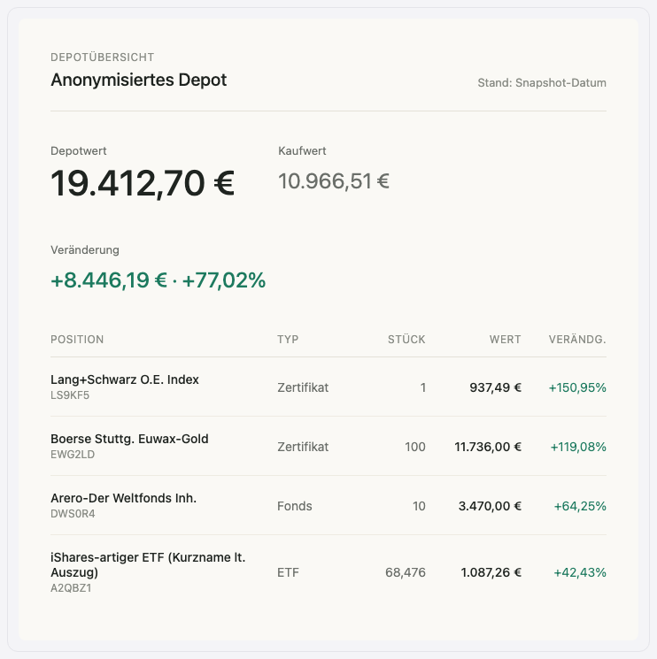
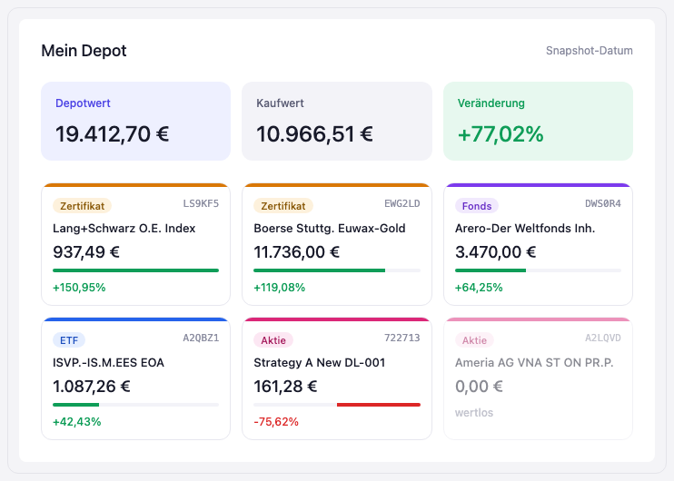
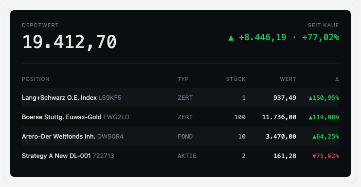
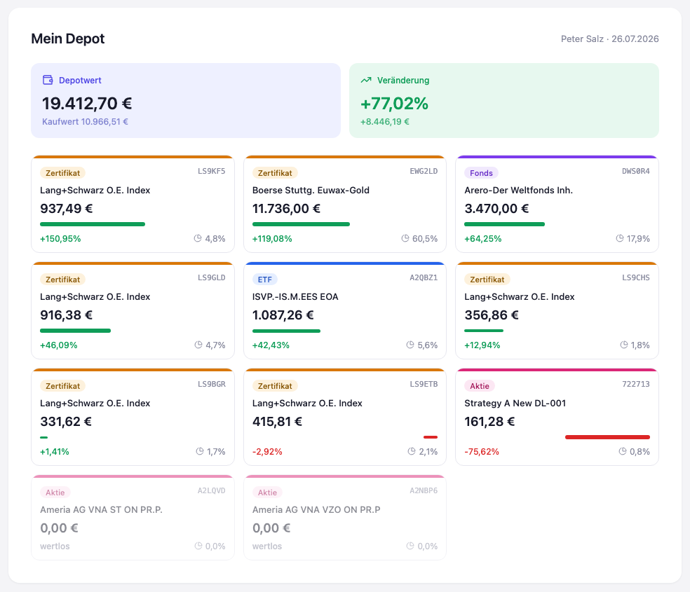

# Stufe 01 — Statische Seite

Übergeordneter Kontext: [Projekt.md](Projekt.md).

## Ziel dieser Stufe

In dieser Stufe soll eine reine HTML-Seite entstehen, ganz ohne Interaktivität und ganz ohne
Server, startbar per Doppelklick. Ein Depot-Export dient als Input, daraus wird eine statische
HTML-Seite generiert — ein Snapshot des Portfolios zu einem Zeitpunkt, bewusst anders dargestellt
als eine gewohnte Broker-Oberfläche.

Was ein Vibe Coder hier konkret lernen soll: dass eine App auch komplett ohne Laufzeit-Logik
nützlich sein kann — "Daten rein, HTML raus". Es geht darum, den Unterschied zwischen *Generierung*
(einmalig, vor dem Ausliefern) und *Interaktion* (zur Laufzeit im Browser) bewusst zu erleben,
bevor in späteren Stufen überhaupt JavaScript oder ein Server dazukommen.

## Ausgangsmaterial

Grundlage war ein anonymisierter Depotauszug (Kopie liegt in
[assets/depotauszug.csv](assets/depotauszug.csv), UTF-8-umkodiert): 11 Positionen, Depotwert rund
19.400 €, gemischte Anlageklassen (mehrere Zertifikate, ein Fonds, ein ETF, zwei Aktien, davon eine
inzwischen wertlos).

Als Anregung diente außerdem der Screenshot einer bestehenden Online-Broker-Oberfläche — eine
dichte, spaltenreiche Tabellenansicht. Nicht als Vorlage zum Nachbauen, sondern im Gegenteil: als
das, was hier bewusst *nicht* wiederholt werden sollte.

## Design-Exploration: drei Vorschläge

Statt direkt Code zu schreiben, wurden drei visuelle Richtungen als interaktive Mockups im Chat
gezeigt, zur Auswahl gestellt und im Nachhinein als Bilder hier archiviert:

- **A — Editorial**: ruhig, warmes Off-White, große Zahl für den Depotwert, Positionen als
  schlanke Liste. Wirkung: aufgeräumtes Finanzmagazin.

  

- **B — Kartenraster**: jede Position als eigene Karte, farbcodiert nach Anlageklasse
  (Zertifikat/Fonds/ETF/Aktie), mit Balken für die Wertentwicklung. Wirkung: moderne
  Consumer-Finance-App.

  

- **C — Terminal**: dunkler Hintergrund, monospaced Zahlen, dicht. Wirkung: Trading-Terminal,
  aber aufgeräumt statt überladen.

  

Alle drei mit echten Daten aus der CSV, aufgebaut auf einem 12×12px-Grundraster (Abstände
durchgehend in 12/24/36/48px). Entscheidung: **Variante B**, mit der ausdrücklichen Begründung,
dass weniger Informationen auf einen Blick hier kein Nachteil sind, sondern der Punkt der Übung —
das Wesentliche soll leichter sichtbar sein als im Original. Details lassen sich bei Bedarf später
nachrüsten.

## Iterationen an Variante B

Ausgehend vom ersten Kartenraster-Entwurf gab es mehrere gezielte Korrekturen:

1. **Kaufwert verkleinert**, dann ganz aus einer eigenen Kachel entfernt und stattdessen klein
   unter den Depotwert gesetzt — es sollten nur noch zwei Kacheln oben stehen: Depotwert und
   Veränderung.
2. **Veränderung zeigt jetzt absolut und relativ** (z. B. "+77,02%" groß, "+8.446,19 €" klein
   darunter), nicht nur den Prozentwert.
3. **Balken-Skala überarbeitet.** Der ursprüngliche lineare Balken (100 % Länge = größter
   beobachteter Wert) war fachlich falsch, weil Gewinne über 100 % möglich sind und die Balken
   dann nicht mehr sinnvoll vergleichbar wären. Umgestellt auf eine logarithmische Skala mit zwei
   Ankerpunkten (100 % Kursgewinn ≈ halbe Balkenlänge, 500 % ≈ ca. drei Viertel) — nie eine harte
   Obergrenze, nur zunehmend flacher werdend. Drei Visualisierungsvarianten wurden zur Wahl
   gestellt (nur Länge log-skaliert / Länge **und** Dicke log-skaliert / sanfte Aufwärtskurve
   statt Balken). Gewählt: Länge und Dicke, **mit gedeckelter Dicke** (3–9px), damit auch die
   Linienstärke nicht unbegrenzt wächst.
4. **Portfolio-Anteil pro Position ergänzt** (z. B. "60,5 %" für den größten Posten), mit einem
   Tortendiagramm-Icon davor. Dabei explizite Vorgabe: künftig durchgehend Lucide-Icons statt der
   vom Werkzeug standardmäßig vorgeschlagenen Tabler-Icons — als Inline-SVG umgesetzt, da kein
   Lucide-Webfont zur Verfügung stand.

## Generierung und ein handfester Fehler

Aus dem abgestimmten Entwurf wurde [index.html](../index.html) im Repo-Root erzeugt — eine
einzelne, abhängigkeitsfreie HTML-Datei, startbar per Doppelklick, ohne Server und ohne
Laufzeit-Logik.

Danach fiel auf: mehrere Positionsnamen waren unvollständig oder schlicht falsch.

- Bei vier von elf Positionen fehlten Endungen aus dem CSV-Feld `Bezeichnung`
  (z. B. `STRATEGY A NEW DL-001` wurde zu `Strategy A New`, `AMERIA AG VNA ST ON PR.P.` zu
  `Ameria AG VNA ST ON`).
- Bei einer Position (`A2QBZ1`, CSV-Text `ISVP.-IS.M.EES EOA`) wurde der Name nicht nur gekürzt,
  sondern durch einen **erfundenen** Namen ersetzt: `iShares Core MSCI EM IMI` — eine plausibel
  klingende Vermutung, was die Abkürzung bedeuten könnte, aber nicht das, was tatsächlich in der
  Quelle stand.

Das war kein Darstellungsproblem, sondern ein handfester Datentreue-Fehler: eine
Wissens-Assoziation ("das klingt nach einem bekannten ETF") wurde über den tatsächlichen
Feldinhalt gestellt. Bei Portfolio-/Finanzdaten ist das nicht tolerierbar.

## Reaktion: wie wird Datentreue künftig sichergestellt?

Die entscheidende Frage danach: reicht ein zweiter, gegenprüfender Agent als Absicherung?
Antwort: nicht als primäre Maßnahme. Ein zweites Sprachmodell kann denselben Fehlertyp korreliert
wiederholen oder übersehen — für *wörtliche* Datentreue ist ein deterministischer
String-Abgleich zuverlässiger, günstiger und für den Nutzer selbst nachvollziehbar.

Die Umsetzung eines solchen Prüfskripts verlief allerdings selbst nicht auf Anhieb sauber — was
Teil der Geschichte bleibt, weil es die Grenzen von "deterministisch" gut zeigt:

1. **Versuch 1** griff auf die falsche CSV-Spalte für die WKN zu (eine leere Spalte statt der
   echten WKN-Spalte). Die Prüfschleife übersprang dadurch jede Zeile sofort und meldete am Ende
   fälschlich "alles OK" — ein stiller Fehlalarm in die falsche Richtung, ohne dass tatsächlich
   etwas geprüft wurde.
2. **Versuch 2** (korrigierte Spalte) meldete daraufhin 10 von 11 Positionen als fehlend — diesmal
   falsch *positiv*, weil der Vergleich case-sensitiv war und die Seite bewusst Sentence Case
   verwendet (`Lang+Schwarz O.E. Index` statt CSV-Original `LANG+SCHWARZ O.E. INDEX`).
3. **Versuch 3** (case-insensitiver Vergleich) bestätigte korrekt: alle 11 Bezeichnungen und WKNs
   stecken wortgetreu in `index.html`.

Festgehaltene Regel für alle künftigen Stufen: Namen, WKN/ISIN und Beträge aus Quelldateien sind
wörtliche Zeichenketten, keine Wissensfragen — nur rein formale, offengelegte Formatierung
(z. B. Groß-/Kleinschreibung) ist erlaubt, der Inhalt selbst darf nie aus Wiedererkennung heraus
verändert werden. Nach jeder Datenübertragung läuft künftig standardmäßig ein Prüfskript, bevor
eine Aufgabe als erledigt gemeldet wird.

## WKN-Links zu finanzen.net

Zusätzlich gewünscht: die WKN jeder Position soll anklickbar sein und in einem neuen Tab die
Titelseite bei einem bekannten Finanzportal öffnen. Das URL-Muster
`https://www.finanzen.net/suchergebnis.asp?_search=<WKN>` wurde live im Browser gegen mehrere
echte WKNs getestet (u. a. `722713`, `EWG2LD`) und leitet zuverlässig zur passenden Titelseite
weiter, bevor es in die Seite übernommen wurde.

## Ergebnis

Alle 11 Positionen mit korrekten, wortgetreuen Namen, anklickbaren WKN-Links, log-skalierten und
dickenbegrenzten Balken sowie Portfolio-Anteil je Position. Bewusst deutlich reduzierter
Informationsgehalt gegenüber einer klassischen Broker-Oberfläche — das ist hier kein Mangel,
sondern das Ziel der Stufe.

## Mitgenommene Lektionen

- Bei der Übertragung von Quelldaten in generierte Artefakte: Felder wörtlich behandeln, nie aus
  Erkennung heraus "vervollständigen".
- Deterministische Prüfskripte schlagen einen zweiten prüfenden Agenten bei wörtlicher
  Datentreue — aber auch ein Prüfskript kann falsch sein; sein Ergebnis kurz gegenlesen statt
  blind einer grünen Meldung zu vertrauen.
- Lucide-Icons sind ab jetzt der Standard für UI-Mockups in diesem Projekt.
- Design-Entscheidungen (Kartenraster statt Editorial/Terminal, log-Skala statt linear, gedeckelte
  Balkendicke) wurden iterativ und mit mehreren visuellen Alternativen zur Auswahl getroffen,
  nicht in einem Schritt festgelegt.
