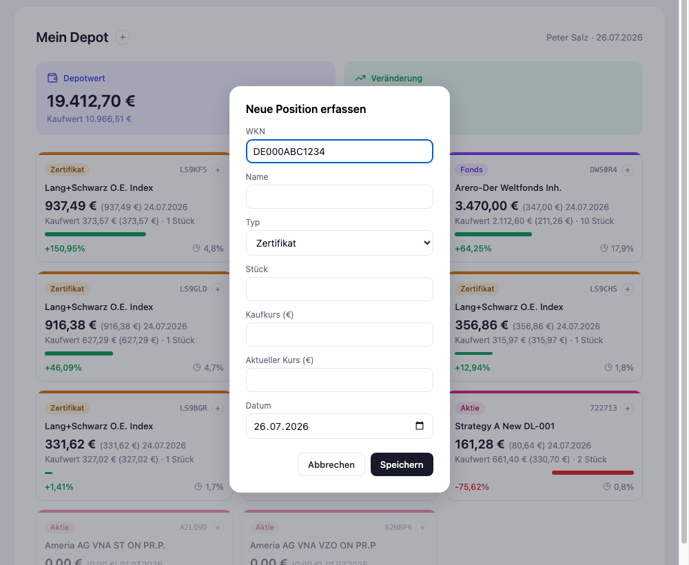
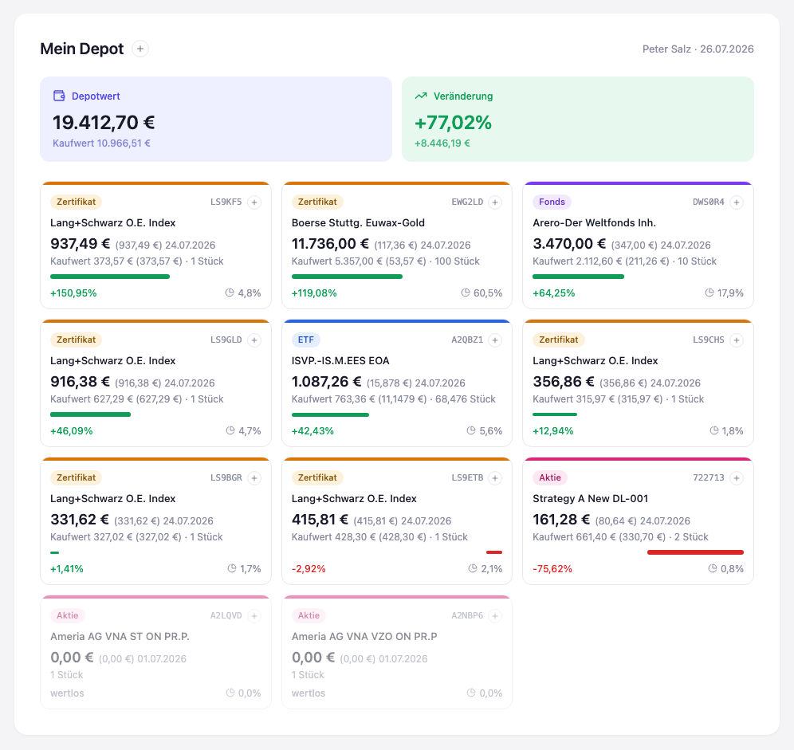

# Stufe 02 — Interaktive Seite

Übergeordneter Kontext: [Projekt.md](Projekt.md).

## Ziel dieser Stufe

In dieser Stufe sollte JavaScript Eingaben direkt im Browser verarbeiten, ohne jede Speicherung —
Zustand existiert nur im Speicher des offenen Tabs, ein Reload verwirft ihn wieder (das kommt
erst in einer späteren Stufe).

Was ein Vibe Coder hier lernen soll: dass eine reine HTML-Datei ohne Server, ohne Framework und
ohne Build-Schritt trotzdem echt dynamisch sein kann. Ein natives `<dialog>`-Element, etwas
Event-Delegation und ein `render()`, der bei jeder Änderung neu aus den Daten aufbaut, reichen
dafür aus.

## Zwei Inkremente

Statt direkt Formulare zu bauen, wurde die Stufe bewusst in zwei Schritte geteilt: erst die Daten
von der Darstellung trennen (ohne neues Verhalten), danach erst Eingabe ermöglichen.

### Inkrement 1: Event-Store statt eingebackenem HTML

Die Positionsdaten aus Stufe 1 waren direkt ins Markup geschrieben. Jetzt liegen sie in einem
einzigen, klar abgegrenzten `events`-Array, aus dem eine `render()`-Funktion die Karten aufbaut —
Ziel war zunächst *pixelgleich* zu Stufe 1, nur anders erzeugt.

Die Ereignis-Hülle wurde dabei noch einmal überarbeitet, nach kurzer Diskussion über technische
vs. fachliche Datumsangaben:

- Jedes Ereignis hat `seq`, `eventType`, `timestamp` und eine `payload`.
- `timestamp` ist rein technisch (wann der Eintrag geschrieben wurde) und hat **keine fachliche
  Bedeutung** — bewusst von den eigentlichen Positionsdaten getrennt gehalten.
- Jede `payload` bekam stattdessen ein einheitliches Feld `datum`, dessen Bedeutung vom
  `eventType` abhängt: bei `kauf` das Kaufdatum, bei `kursupdate` das Datum des Kurses selbst.
- Für `kursupdate` war dieses Datum in den Ausgangsdaten vorhanden und wurde übernommen. Für
  `kauf` gab es kein überliefertes Kaufdatum — hier wurde einheitlich der 1.7.2026 angenommen,
  offengelegt im Code als benannte Konstante statt versteckt einzeln eingetragen.

### Inkrement 2: Erfassung neuer Ereignisse

Zwei Erfassungswege wurden entworfen und umgesetzt:

- **Global** (kleines "+" neben dem Titel): legt eine komplett neue Position an. Braucht sowohl
  Kaufkurs als auch aktuellen Kurs, weil eine neue Position ohne aktuellen Kurs sofort "wertlos"
  wirken würde — daher werden beim Speichern ein `kauf`- **und** ein `kursupdate`-Ereignis
  zusammen angelegt.
- **Lokal** (kleines "+" an jeder Karte): öffnet ein Mini-Menü mit zwei Optionen, **Kauf
  erfassen** (Nachkauf) oder **Kursupdate erfassen** — bewusst als Menü statt zwei einzelne Icons,
  um die Karten nicht zu überladen.

Beide Wege nutzen native `<dialog>`-Elemente statt eines Frameworks oder eigenem Modal-Code.

Eine kleine, aber wichtige Modellfrage kam beim Nachkauf auf: mehrere `kauf`-Ereignisse zur
selben Position müssen sich **addieren**, nicht gegenseitig überschreiben. Die Aggregation wurde
entsprechend gebaut — Stückzahl summiert sich, der Kaufwert ist die Summe der einzelnen
Stück-mal-Kaufkurs-Anteile, und daraus ergibt sich automatisch ein durchschnittlicher Kaufkurs
über alle Käufe hinweg.

Kleiner Komfort obendrauf: Im Formular für eine neue Position wird der aktuelle Kurs, sofern
das Feld noch leer ist, automatisch mit dem Kaufkurs vorbelegt, sobald das Kaufkurs-Feld
verlassen wird — meist ist der aktuelle Kurs beim Neuanlegen ohnehin (noch) identisch.

## Die Karten zeigen jetzt mehr

Die Kartenansicht aus Stufe 1 war bewusst knapp gehalten — jetzt kam der Wunsch nach mehr Detail,
ohne die große Zahl ihre Wirkung zu nehmen:

- **Groß** weiterhin: der aktuelle Wert der Position.
- **Klein daneben**: der aktuelle Kurs in Klammern, dazu das Datum der letzten Aktualisierung.
- **Zeile darunter, klein**: Kaufwert, der (durchschnittliche) Kaufkurs in Klammern, und die
  Stückzahl.

Bei der Formatierung fiel auf, dass Kurse unterschiedliche Genauigkeit brauchen — ein
Bruchstück-ETF hat einen Kaufkurs wie 11,1479 €, während die meisten anderen Positionen glatte
zwei Nachkommastellen haben. Feste zwei Nachkommastellen hätten hier echte Genauigkeit verloren;
stattdessen zeigt die Kursformatierung zwei bis vier Nachkommastellen, je nachdem was der Wert
tatsächlich braucht.

## Ein Fehlalarm

Es wurde ein Fehler gemeldet: ein neu erfasster Kurs, der zeitlich vor dem bisher aktuellen lag,
werde trotzdem angezeigt. Mehrere gezielte Tests mit unterschiedlichen Positionen und Daten
zeigten aber jedes Mal korrektes Verhalten — der bestehende, spätere Kurs blieb erwartungsgemäß
sichtbar. Der gemeldete Fall ließ sich nicht reproduzieren und stellte sich als Irrtum heraus.

Festgehalten sei trotzdem der Reflex dahinter: vor einer Code-Änderung erst gezielt nachstellen,
was gemeldet wurde, statt vermutungsbasiert etwas zu "reparieren", das bereits richtig
funktioniert.

## WKN, ISIN, Ticker

Kurz diskutiert wurde, ob WKN und ISIN (später auch Tickersymbol) getrennte Felder brauchen, und
ob sich der Typ am Format erkennen ließe. Ergebnis: eine ISIN ist formal zuverlässig erkennbar
(12 Zeichen, feste Struktur), ein Tickersymbol lässt sich von einer WKN aber nicht zuverlässig
unterscheiden — beides sind kurze, uneinheitliche alphanumerische Kürzel. Da die Anwendung den
Wert ohnehin nirgends unterschiedlich behandelt (nur als Schlüssel, Anzeige und Suchbegriff für
den finanzen.net-Link), blieb es bei einem einzigen Freitextfeld, ohne Erkennungslogik zu bauen,
die für den wichtigsten Fall (Ticker vs. WKN) ohnehin nicht zuverlässig funktionieren könnte.

## Ergebnis

Weiterhin eine einzelne, abhängigkeitsfreie HTML-Datei ohne Server — aber jetzt mit echter
Interaktivität. Neue Positionen, Nachkäufe und Kursaktualisierungen lassen sich direkt in der
Seite erfassen, alle abgeleiteten Zahlen (Depotwert, Veränderung, Portfolio-Anteile,
durchschnittlicher Kaufkurs) aktualisieren sich sofort. Der Zustand bleibt bewusst flüchtig —
ein Reload verwirft ihn, Persistenz ist Thema einer späteren Stufe.

## Mitgenommene Lektionen

- Reine HTML+JS-Seiten können dynamisch sein, ganz ohne Server oder Framework — natives
  `<dialog>` und Event-Delegation genügen für ein rundes Erfassungserlebnis.
- Technische und fachliche Datumsangaben sauber trennen: eine Aufzeichnungszeit ist keine
  Domänen-Information.
- Mehrfache Ereignisse zur selben Entität (hier: Nachkäufe) müssen sich im Datenmodell korrekt
  aggregieren, nicht überschreiben.
- Ein gemeldeter Fehler ist nicht automatisch ein echter Fehler — gezielt nachstellen, bevor man
  Code ändert.
- Formaterkennung nur bauen, wenn sie zuverlässig möglich *und* tatsächlich gebraucht wird.
