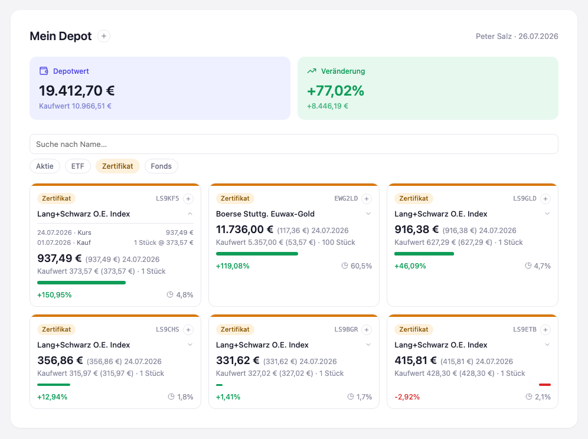

# Stufe 03 — Automatisierte Tests

Übergeordneter Kontext: [Projekt.md](Projekt.md).

## Ziel dieser Stufe

In dieser Stufe soll Domänenlogik automatisiert testbar werden, mit gemessener
Testabdeckung. Das setzt voraus, dass sich diese Logik überhaupt isoliert ausführen lässt —
bisher steckte alles in einer einzigen HTML-Datei, untrennbar mit Rendering und DOM verwoben.

Diese Stufe ist ungewöhnlich, weil drei Dinge gleichzeitig zusammenkommen, die sich gegenseitig
bedingen: eine **Architekturentscheidung** (wie wird der Code in Bausteine geschnitten?), eine
**Infrastrukturentscheidung** (wie laufen Tests, ohne Server und ohne Build-Schritt?), und zwei
**neue Domänen-Features** (Positionsverlauf, Filterung), die erst durch die neue Struktur ihren
naheliegenden Platz finden. Alle drei Fäden werden hier bewusst einzeln aufgerollt, bevor sie am
Ende wieder zusammenlaufen.

## Architektur: Modularisierung nach Separation of Concerns

Modularisiert wird hier nicht, weil eine KI das bräuchte, sondern aus einem einzigen Grund: nur
getrennte, in sich geschlossene Bausteine sind automatisiert testbar. Was bisher als Logik "auf
einem Haufen" in einer einzigen HTML-Datei lag, wird dafür sauber separiert und damit für
automatisierte Tests erreichbar gemacht.

Und warum überhaupt automatisiert testen? Weil nach jeder Änderung geprüft werden soll, ob etwas
kaputtgegangen ist, das vorher funktioniert hat — Regressionen im Verhalten sollen vermieden
werden. Automatisierte Tests prüfen das für weite Teile des Codes schneller und verlässlicher als
manuelles Durchklicken.

Kein spezielles Architekturmuster, sondern die einfachste Aufteilung nach Zuständigkeit — vier
Bausteine, jeder als Fabrikfunktion, die ihre Abhängigkeiten per Parameter bekommt:

- **Event-Store** (`eventStore.js`, ein *Provider*): kapselt die Ressource "Append-only Log".
  Zwei Funktionen, `append(eventType, payload)` und `query(filter)` — Letzteres z. B.
  eingeschränkt auf eine `wertpapierId`. Kennt weder Domäne noch UI.
- **Domäne** (`domain.js`): bekommt den Event-Store injiziert und kapselt darüber den
  App-State. *Commands* (`kaufErfassen`, `kursupdateErfassen`) erzeugen Events, *Queries*
  (`positionenAbfragen`, `positionsverlaufAbfragen`) projizieren Events zu einem Modell. Hier
  steckt die eigentliche Berechnung — Aggregation, Kaufkurs-Durchschnitt, Portfolio-Anteil.
- **Body** (`body.js`): bekommt die Domäne injiziert, kennt aber den Event-Store nicht. Setzt
  mehrere Domänen-Funktionen zu Workflows zusammen — z. B. ist eine neue Position kein
  einzelner Domänen-Command, sondern ein Body-Workflow, der `kaufErfassen` und
  `kursupdateErfassen` nacheinander aufruft (sonst wäre die Position sofort "wertlos"). Das
  Frontend kennt ausschließlich dieses Interface.
- **Frontend** (weiterhin inline in `index.html`): alles HTML/DOM. Ruft nur `body`-Funktionen
  auf, rendert das zurückgegebene Modell.

Ein WKN-Feld wurde dabei in `wertpapierId` umbenannt — ehrlicher, weil es auch ISIN oder
Tickersymbol enthalten kann, nicht zwingend eine WKN.

Die Trennung wurde am Ende der Stufe nochmal geprüft, nicht nur behauptet: eine Suche nach
`document`, `window.`, `innerHTML`, `querySelector` und HTML-Tag-Mustern in allen drei
Moduldateien ergab null Treffer. Im Frontend-Code taucht `domain.`/`eventStore.` nirgends auf
außer in einem einzigen, bewusst begründeten Ausnahmefall — dem Laden des Startbestands beim
Programmstart, das keine Nutzer-Interaktion ist und daher direkt über die Domäne läuft statt über
einen Body-Workflow.

## Infrastruktur: Testen ohne Server, ohne Build-Schritt

Tests brauchen einen eigenen "User". Die App wird normalerweise von einem Menschen im Browser
bedient — aber automatisierte Tests werden gerade nicht von einem Menschen im Browser ausgeführt.
Dafür braucht es eine eigene Infrastruktur: einen Testrunner, der Code ausführen kann, ohne dass
jemand klickt. Diese Rolle übernimmt hier [Deno](https://deno.com): eine eigenständige
Laufzeitumgebung (Runtime) für JavaScript und TypeScript, außerhalb des Browsers. Ein Browser ist
selbst auch so eine Runtime — Deno ist eine andere, ohne eigenes Fenster, gedacht zum Ausführen
von Code über die Kommandozeile.

**Voraussetzung für diese Stufe: Deno muss installiert sein.** Installationsanleitung:
<https://docs.deno.com/runtime/getting_started/installation/>

Diese Runtime ist keine Randnotiz nur für Tests — spätere Stufen (Deno-Server) bauen direkt
darauf auf. Ohne eine Laufzeit jenseits des Browsers stoßen Apps an ihre Grenzen.

Für die App selbst blieb die Vorgabe daneben bestehen: kein Server (Doppelklick-Start soll
erhalten bleiben), kein Build-Schritt. Klassische `<script src="…">`-Einbindung (kein
`type="module"`) plus ein kleiner Guard am Dateiende macht die Moduldateien unter `file://`
nutzbar, ganz ohne Server und ohne Build-Schritt:

```js
function createEventStore() { /* … */ }

if (typeof module !== "undefined") {
  module.exports = { createEventStore };
}
```

Im Browser existiert `module` nicht, der Guard greift nicht, die Funktion bleibt einfach global.
In Deno-Tests wird dieselbe Datei über `node:module`s `createRequire()` geladen. Eine Quelle,
zwei Umgebungen, ohne Duplikation.

**TypeScript.** Bisher war aller Code JavaScript — die Sprache, die ein Browser ohne Umweg
versteht. TypeScript ist JavaScript, erweitert um Typen: man schreibt zusätzlich hin, welche Art
von Wert eine Variable oder ein Funktionsparameter haben soll (Zahl, Text, ein bestimmtes Objekt
…), und ein Prüfschritt meldet Abweichungen, bevor der Code überhaupt läuft. Die Tests dieser
Stufe sind in TypeScript geschrieben, weil dahin die Reise ohnehin gehen soll und weil Deno
TypeScript nativ versteht, ohne Build-Schritt — der Anwendungscode selbst bleibt JavaScript, weil
TypeScript im Browser ohne Build-Schritt nicht läuft.

Deno prüft Typen standardmäßig streng; Callback-Parameter auf den (zwangsläufig `any`-typisierten)
Rückgaben von `require()` brauchten deshalb explizite `: any`-Annotationen, um durchzukommen —
noch keine vollständigen Interfaces, das wäre für den Einstieg zu viel gewesen.

`deno task test` und `deno task coverage` (definiert in `deno.json`, dokumentiert in
`README.md`) führen die Tests aus bzw. messen die Abdeckung:

```
running 23 tests from ./tests/body.test.ts, domain.test.ts, eventStore.test.ts
ok | 23 passed | 0 failed
```

| Datei          | Branch % | Funktion % | Zeile % |
| -------------- | -------- | ---------- | ------- |
| body.js        | 100,0    | 100,0      | 100,0   |
| domain.js      | 97,2     | 100,0      | 100,0   |
| eventStore.js  | 100,0    | 100,0      | 100,0   |

## Domänen-Feature: Positionsverlauf

Auf eine Position klicken klappt eine kompakte, kleine Liste auf: jeder einzelne Kauf und jedes
Kursupdate dieser Position, umgekehrt chronologisch (neuestes zuerst). Bewusst ausschließlich aus
dem bereits vorhandenen Event-Log gespeist — keine neuen Ereignistypen, keine Persistenz, nichts
aus späteren Stufen vorweggenommen. Der aufgeklappte Zustand übersteht weitere Erfassungen.

## Domänen-Feature: Filterung

Ein Suchfeld (Name, Groß-/Kleinschreibung egal) und vier Typ-Chips (Aktie, ETF, Zertifikat,
Fonds) engen ein, welche Karten sichtbar sind. Depotwert, Kaufwert, Veränderung und der
Portfolio-Anteil je Position bleiben dabei unverändert auf das gesamte Depot bezogen, nicht auf
den gefilterten Ausschnitt — sonst würden zwei unterschiedliche Bezugsgrößen gleichzeitig auf dem
Schirm stehen.

Die interessantere Frage war, *wo* die Filterlogik hingehört. Der erste Instinkt — Filterung sei
reine Darstellungsfrage, also Frontend-Sache — war bei genauerem Hinsehen nicht zu Ende gedacht:
Suchbegriff-Abgleich und Typ-Filterung sind reine, DOM-freie Logik und damit automatisiert
testbar. Die Domäne war der falsche Ort dafür (Suchbegriff und ausgewählte Typen sind keine
Domänen-Konzepte, sie tauchen in keinem Event auf), das Frontend auch (dann wäre die Logik nicht
testbar). Body passt: er engt bereits bestehende Domänen-Abfragen für einen konkreten
Frontend-Bedarf ein, genau seine definierte Rolle. `body.depotAbfragen(filter)` filtert das
Ergebnis von `domain.positionenAbfragen()`, bevor es zurückgeht — vollständig durch Tests
abgesichert, inklusive eines expliziten Tests, dass Depotwert/Kaufwert/Veränderung/Anteil sich
durch den Filter nicht verändern.

## Wo die drei Fäden zusammenlaufen

Die Filterung ist das beste Beispiel dieser Stufe: ein Feature-Wunsch, dessen richtige
Platzierung eine Architekturfrage war (Domäne? Body? Frontend?), beantwortet mit Verweis auf die
zuvor festgelegten Zuständigkeiten — und deren Korrektheit am Ende nicht behauptet, sondern durch
die neue Testinfrastruktur nachgewiesen wurde.

Daraus lässt sich eine Faustregel für jedes künftige Feature ableiten: bei jeder neuen
Funktionalität fragen, wo der Code dafür (die Logik) am besten aufgehoben ist, damit möglichst
viel davon automatisiert testbar bleibt — nicht, wo er sich am bequemsten unterbringen lässt.

## Ergebnis



Depotwert und Veränderung bleiben stehen, während der Typ-Filter "Zertifikat" die Ansicht auf
sechs Positionen einschränkt; die erste Karte zeigt ihren aufgeklappten Verlauf.

## Mitgenommene Lektionen

- Modularisierung ist auch bei einer so kleinen App wie dieser möglich und sinnvoll —
  Modularisierung und Testbarkeit sind nicht nur etwas für große Anwendungen.
- Modularisierung und Doppelklick-Fähigkeit sind kein Widerspruch.
- Wo eine Zuständigkeit hingehört, entscheidet sich daran, was sie *wissen muss* — und wo sie
  testbar ist.
- Neue Features lassen sich an bestehenden Architekturentscheidungen prüfen statt neu zu
  verhandeln: dass Depotwert/Veränderung "stehen bleiben", war schon für die Filterung
  festgelegt, bevor die erste Zeile Code dafür geschrieben wurde.
