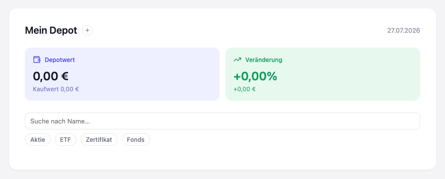

# Stufe 04 — Persistenz mit localStorage

Übergeordneter Kontext: [Projekt.md](Projekt.md).

## Ziel dieser Stufe

Zustand soll erstmals einen Reload überleben — noch an einen Browser/ein Gerät gebunden, aber
nicht mehr nur im Arbeitsspeicher des offenen Tabs. Das Feature selbst ist unspektakulär; die
Lektion ist die Architektur dahinter: "State überlebt die Seite" ist etwas grundlegend anderes
als alles Bisherige, und das im bestehenden Schichtenmodell sauber unterzubringen, ist die
eigentliche Übung dieser Stufe.

## Leerer Start statt Startbestand

Der bisherige, fest im Code hinterlegte Startbestand ist raus — das Depot beginnt jetzt wirklich
leer. Nur so lässt sich echte Persistenz überhaupt zeigen: Wenn bei jedem Laden ohnehin dieselben
Daten erscheinen, sieht man nicht, ob sie wirklich gespeichert wurden oder einfach neu erzeugt
werden. Der alte Bestand ist nicht verloren, sondern liegt jetzt als eigene Datei
([startbestand.json](../startbestand.json)) bereit — Grundlage für den Datei-Import, den Stufe 5
einführt. Mit dem leeren Start verschwindet auch der feste Name eines Depotinhabers aus dem Kopf
der Seite.

## Wo Persistenz in der Architektur sitzt

`localStorage` ist eine Browser-Technologie, darf aber nicht in den Event-Store oder die Domäne
einsickern — beide bleiben genauso unwissend über Speicherung wie zuvor. Nur der Body kennt einen
neuen, eigenen Baustein: einen Provider, der Speichern und Laden kapselt. Der Event-Store selbst
bekommt seinen Anfangsbestand nur einmal, bei seiner Erzeugung, übergeben — er weiß nicht, ob
dieser Bestand aus dem Nichts, aus einer Datei oder aus dem Browser-Speicher kommt. Nach jeder
Erfassung schreibt der Body den kompletten aktuellen Bestand zurück; das Frontend bekommt davon
nichts mit.

Diese Entscheidung — Persistenz beim Body statt beim Event-Store aufzuhängen — wurde
zwischenzeitlich anders getroffen und wieder korrigiert: Der Event-Store sollte unter keinen
Umständen selbst wissen, dass und wohin er gespeichert wird. Sonst wäre er kein reiner
Append-only-Speicher mehr, sondern etwas, das sich von außen jederzeit austauschen lässt.

## Ergebnis

Direkt nach dem allerersten Start ist das Depot leer. Nach einer Erfassung übersteht der Zustand
einen Reload unverändert — geprüft sowohl automatisiert als auch von Hand im Browser.

## Mitgenommene Lektionen

- Eine Funktionalität kann fachlich unspektakulär sein und trotzdem die Stufe mit der wichtigsten
  architektonischen Lehre sein.
- Um Persistenz ehrlich zu zeigen, musste zuerst der Startbestand weichen, der sie sonst verdeckt
  hätte.
- Nicht jeder Baustein, der mit einer Ressource zu tun hat, darf sie auch selbst kennen — die
  Grenze verläuft danach, wer wissen *muss*, nicht danach, wo es am bequemsten wäre.
- Auch eine Browser-Technologie lässt sich sauber unterhalb der Oberfläche einbinden, wenn nur
  eine einzige Stelle im Code weiß, dass es sich überhaupt um Browser-Technologie handelt.
