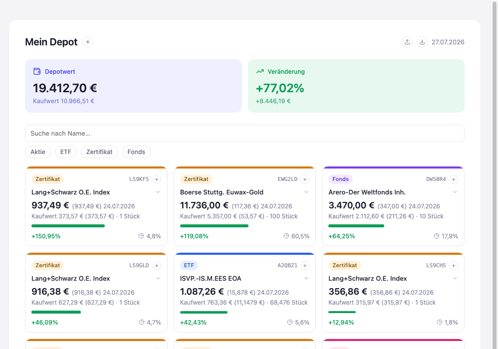

# Stufe 05 — Zustand laden/speichern (JSON)

Übergeordneter Kontext: [Projekt.md](Projekt.md).

## Ziel dieser Stufe

Der Zustand lässt sich jetzt zusätzlich als Datei sichern und aus einer Datei laden. Das ist
eine andere Art von Persistenz als in Stufe 4 — und genau der Unterschied ist die Lektion dieser
Stufe.

## Zwei Arten von Persistenz

Stufe 4 hat gezeigt, dass Zustand einen Reload überleben kann, unsichtbar im Browser gespeichert.
Das ist bequem, aber der Nutzer hat keinen Zugriff darauf: Er kann diese Daten nicht ansehen,
nicht verschieben, nicht mit jemandem teilen, nicht sichern, bevor er den Browser-Speicher löscht
oder das Gerät wechselt.

Diese Stufe ergänzt eine zweite, bewusst sichtbare Form: eine echte Datei, die der Nutzer selbst
in der Hand hat. Beide Formen ergänzen sich, sie ersetzen einander nicht — automatische
Persistenz im Hintergrund für den Alltag, eine Datei für alles, was darüber hinausgeht: Backup,
Umzug auf ein anderes Gerät, Weitergabe an jemand anderen, ein Startpunkt für neue Nutzer.

## Ergebnis

Die beiden neuen Symbole im Kopfbereich laden eine Datei bzw. speichern den aktuellen Stand in
eine. Der hier gezeigte Bestand stammt aus genau so einer Datei — dem alten Startbestand aus
Stufe 1, der in Stufe 4 weichen musste und jetzt auf diesem Weg zurückfindet.

## Mitgenommene Lektionen

- "Persistent" ist keine einzelne Eigenschaft, sondern hat Ausprägungen: unsichtbar und
  automatisch (Stufe 4) oder sichtbar und vom Nutzer kontrolliert (diese Stufe) — mit
  unterschiedlichem Nutzen für unterschiedliche Situationen.
- Eine Datei macht die eigenen Daten portabel und dem Nutzer gehörend, statt an eine App oder
  ein Gerät gebunden zu bleiben.
