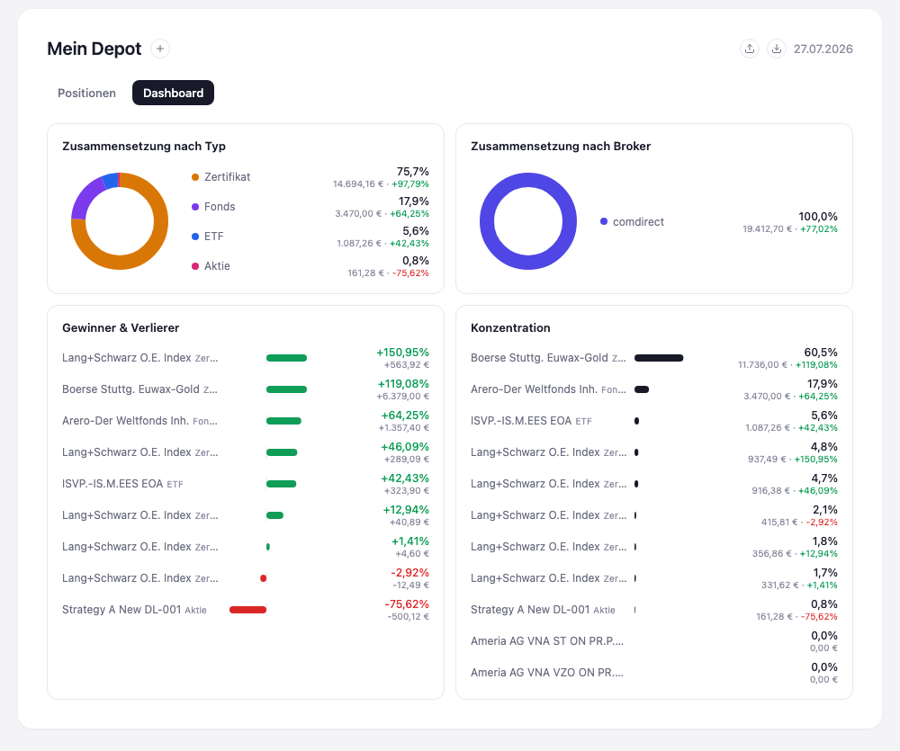

# Stufe 06 — Mehrere Seiten mit Routing

Übergeordneter Kontext: [Projekt.md](Projekt.md).

## Ziel dieser Stufe

Bisher gab es in der App genau eine Ansicht: die Liste der Positionen. Alles, was in den
vorherigen Stufen dazukam, hat diese eine Ansicht entweder verändert (Suche, Typ-Filter) oder kurz
unterbrochen (die Dialoge zum Erfassen), aber nie verlassen. Diese Stufe bringt zum ersten Mal
eine zweite, eigenständige Seite dazu: ein Dashboard, das nicht einzelne Positionen zeigt, sondern
das Depot als Ganzes — seine Zusammensetzung, seine Gewinner und Verlierer, seine Konzentration.

Die eigentliche Lektion ist dabei nicht "es gibt jetzt ein Dashboard mit Grafiken". Die Lektion
ist, dass die App zum ersten Mal mehr als eine Seite hat — und dass dafür ein eigenes Mittel nötig
war, das es vorher nicht gab: Routing. Laut Projektplan ist das die erste Strukturentscheidung
dieser App, die über eine einzelne Seite hinausgeht.

## Drei Werkzeuge für drei verschiedene Bedürfnisse

Die App kannte bis hierhin zwei Wege, wie sich die Oberfläche verändert, wenn der Nutzer etwas
tut. Beide bleiben bestehen und wurden in dieser Stufe sogar noch erweitert (der neue
Broker-Filter). Routing ist ein drittes, neues Mittel — und der Unterschied zwischen allen dreien
ist wichtiger als jedes technische Detail dazu:

- **Dialog** (seit Stufe 2, z. B. "Kauf erfassen"): ein kurzer Ausflug für eine einzelne,
  abgeschlossene Handlung. Die Ansicht dahinter wird angehalten, nicht verändert — nach dem
  Abschließen oder Abbrechen ist man wieder exakt dort, wo man vorher war.
- **Filter** (Suchbegriff, Typ, jetzt auch Broker): verändert nicht, *was* man sich ansieht,
  sondern nur, *wie viel* davon sichtbar ist. Man bleibt die ganze Zeit in derselben Ansicht, mit
  demselben Zweck — "meine Positionen durchsehen" — nur mit einem enger gefassten Ausschnitt.
- **Route** (neu in dieser Stufe): wechselt zu einer Ansicht mit einem *grundsätzlich anderen
  Zweck*. Das Dashboard ist keine gefilterte Positionsliste, es beantwortet andere Fragen als die
  Positionen-Seite. Das ist weder eine Unterbrechung wie der Dialog noch eine Einschränkung wie
  der Filter, sondern ein eigener Ort in der App.

Diese Unterscheidung ist der Grund, warum ein Dashboard kein weiterer Filter oder ein weiterer
Dialog sein konnte, sondern etwas Neues brauchte.

## Was eine Route leistet

Eine Route ist eine Adresse für eine bestimmte Ansicht innerhalb derselben App — bei einer
Webanwendung typischerweise der Teil der URL nach dem `#`. Zwei Eigenschaften machen das nützlich,
über den reinen Ortswechsel hinaus:

- Jede Seite hat dadurch eine eigene, merkbare Adresse. Man kann sie direkt aufrufen, im Browser
  mit "Zurück" wieder verlassen oder sich später genau dorthin zurückbewegen — ganz ohne dass die
  App das explizit unterstützen müsste.
- Der Wechsel selbst lädt die Seite nicht neu. Das schließt an eine Regel an, die sich durch die
  gesamte bisherige Entwicklung zieht: kein `location.reload()` als Behelfslösung. Der Zustand der
  App bleibt beim Seitenwechsel erhalten, nur die Sicht darauf ändert sich.

Der praktische Effekt: Die App kann jetzt in der *Breite* wachsen — neue Perspektiven auf dieselben
Daten — statt nur in der *Tiefe* wie bisher (mehr Felder, mehr Filter, mehr Details pro Position).
Eine neue Seite lässt sich hinzufügen, ohne die bestehenden anzufassen.

## Ergebnis

Oben links wechselt man zwischen "Positionen" und "Dashboard". Das Dashboard aggregiert den
gesamten Bestand aus Stufe 1 zu vier Perspektiven, die auf der Positionen-Seite so nicht
sichtbar wären: Zusammensetzung nach Typ und nach Broker, eine Rangliste nach Gewinn/Verlust und
die Konzentration des Depots auf einzelne Positionen.

## Mitgenommene Lektionen

- Nicht jede neue Fähigkeit ist eine Erweiterung von etwas Bestehendem. Manche brauchen eine neue
  Kategorie von Mittel — Filter und Dialoge lösen andere Bedürfnisse als eine zweite Seite, und
  keines der beiden ließ sich zu einem Dashboard hin ausbauen.
- Eine Route ist weniger ein technisches Detail als ein Versprechen an den Nutzer: "Das hier ist
  ein eigener, wiederfindbarer Ort" — nicht nur ein temporärer Zustand der aktuellen Ansicht.
  Das unterscheidet routbare Seiten von allem, was sich Filter oder Auf-/Zuklappen nennt.
