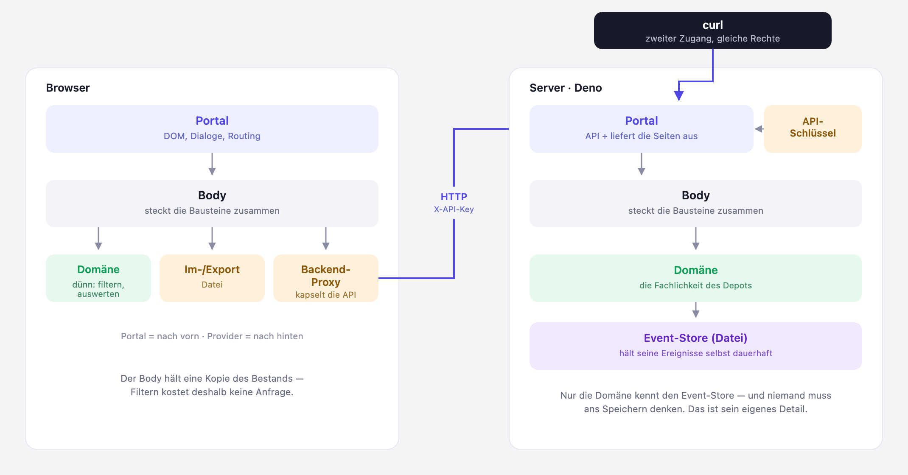

# Stufe 07 — Deno-Server mit eigener API

Übergeordneter Kontext: [Projekt.md](Projekt.md).

## Ziel dieser Stufe

Die Anwendung wird in Client und Server geteilt. Nach außen ändert sich dabei fast nichts: die
Oberfläche im Browser sieht aus wie vorher und kann dasselbe wie vorher. Das ist kein Versehen,
sondern die Definition dieser Stufe — sie ist im Kern ein Refactoring. Was sich ändert, ist die
Makrostruktur, und aus der folgen dann zwei Dinge, die vorher nicht möglich waren.

## Warum überhaupt teilen?

Bisher lief alles im Browser. Das hatte zwei Grenzen, die sich nicht durch mehr Sorgfalt im Code
beheben ließen, sondern nur durch einen anderen Zuschnitt:

**Die Daten gehörten dem Browser, nicht der Anwendung.** Was gespeichert war, lag im Speicher
genau eines Browsers auf genau einem Gerät. Der Datei-Export aus Stufe 5 war deshalb nicht nur
Komfort, sondern ein Stück weit Notwehr: Wer seine Daten behalten wollte, musste selbst daran
denken. Mit einem Server gibt es einen Ort, der die Daten hält — und der schreibt sie bei jeder
Erfassung fest, ohne dass jemand etwas exportieren muss. Der Export bleibt trotzdem, aber seine
Rolle ändert sich: vom Sicherheitsnetz zur bewussten Kopie.

**Es gab genau eine Art, die Anwendung zu benutzen.** Alles, was das Depot konnte, konnte man nur
durch Klicken erreichen. Sobald die Fachlichkeit hinter einer API sitzt, ist die Oberfläche im
Browser nur noch *einer* von mehreren möglichen Zugängen.

## Die App starten

Bis Stufe 6 genügte ein Doppelklick auf `index.html`. Das ist vorbei — es gibt jetzt einen
Server, der laufen muss, bevor irgendetwas zu sehen ist. Damit das kein Hindernis wird, liegt im
Wurzelverzeichnis ein Startskript:

```bash
./run.sh
```

Danach ist die App unter `http://localhost:8000` erreichbar. Ein anderer Port geht per Argument
(`./run.sh 8080`).

Das Skript ist bewusst mehr als eine Abkürzung fürs Tippen. Deno erlaubt einem Programm von Haus
aus **gar nichts** — jedes Recht muss einzeln erteilt werden, und genau diese Rechte stehen im
Skript, jeweils mit dem Grund daneben:

| Recht | wofür |
|---|---|
| `--allow-net` | auf dem Port lauschen |
| `--allow-read` | Client-Dateien ausliefern, Ereignisse und Schlüssel lesen |
| `--allow-write` | Ereignisse und Schlüssel nach `server/data/` schreiben |
| `--allow-env` | die Port-Einstellung auslesen |

Diese Liste ist kurz genug, um sie zu lesen und zu verstehen — das ist der eigentliche Wert. Ein
pauschales „alle Rechte" wäre bequemer gewesen und hätte genau diese Aussage verschenkt: dass
dieser Server erstaunlich wenig darf.

## Portale und Provider: zwei Richtungen von Adaptern

Für den Umbau war ein Begriff nötig, den es vorher nicht gab. Bisher kannte die Architektur
Provider: Bausteine, die nach hinten zu einer Ressource adaptieren — zum Browser-Speicher, zur
Datei. Der Body kennt sie, sie kennen keine Fachlichkeit.

Was fehlte, war das Gegenstück: ein Baustein, der nach vorn adaptiert, also von außen kommende
Anfragen entgegennimmt und in Aufrufe des Body übersetzt. Das ist ein **Portal**. Die Oberfläche
im Browser war immer schon eines, sie hieß nur nicht so. Jetzt gibt es zwei davon — eines im
Browser, das die UI-Technologie kapselt, und eines im Server, das HTTP kapselt. Beide kennen nur
den Body. Keines von beiden weiß, wie das Depot rechnet.

Damit ist die Regel für jeden Baustein dieselbe geblieben, nur klarer benannt: Portale sind das
Draußen, Provider sind das Dahinter, dazwischen liegt der Body, und die Fachlichkeit ganz innen
merkt von beidem nichts.



## Ein Umweg: wer soll speichern?

Der erste Entwurf hatte den Event-Store gelassen, wie er war — flüchtig, nur im Arbeitsspeicher —
und daneben einen zusätzlichen Provider gestellt, der den Bestand in eine Datei schrieb. Der Body
rief nach jedem Command beides auf: erst die Fachlichkeit, dann das Speichern.

Das war eine unbewusste Übernahme aus Stufe 4. Dort galt ausdrücklich, dass der Event-Store nicht
wissen darf, wohin er gespeichert wird — und das war richtig, denn Persistenz hieß damals
`localStorage`, also eine Eigenheit des Browsers, an die man den Kern der Anwendung nicht binden
wollte. Übernommen wurde die Struktur, nicht ihre Begründung. Und die Begründung war entfallen:
Ein Server, dessen Zweck es ist, Zustand dauerhaft zu halten, hat keinen Grund mehr, das Speichern
nach außen zu delegieren.

Woran man den Fehler erkennt, sind seine Folgen. Der Body musste nach *jedem* Command daran
denken, zu sichern — ein einziges vergessenes „jetzt speichern" hätte gereicht, um Daten zu
verlieren. Und die Domäne musste ihren Zustand nach außen herausgeben können, nur damit jemand
anderes ihn wegschreiben konnte. Beides sind Symptome derselben Sache: Eine Zuständigkeit lag
nicht dort, wo sie hingehört.

Jetzt ist der Event-Store selbst persistent. Er bekommt bei seiner Erzeugung einen Dateinamen und
kümmert sich um den Rest; von außen ist er schlicht ein Event-Store, dem man Ereignisse anhängt
und aus dem man liest. Ob, wann und wohin er schreibt, ist sein eigenes Detail — eine Black Box in
genau dieser Hinsicht. Der Body ist dadurch spürbar kleiner geworden, und die Möglichkeit,
Speichern zu vergessen, existiert nicht mehr.

## Ein Vertrag statt einer Ähnlichkeit

Von diesem Medium wird es mehrere Ausprägungen geben: im Arbeitsspeicher, in einer Datei, später
in einer Datenbank. Sie unterscheiden sich nur darin, *wo* die Ereignisse liegen — und das erfährt
jede bei ihrer Erzeugung: hier ein Anfangsbestand, dort ein Dateiname, später ein Connection
String. Nach außen müssen sie austauschbar sein.

„Müssen austauschbar sein" ist als Absichtserklärung wertlos, solange nichts es prüft. Deshalb
steht der Vertrag nicht als Kommentar da, sondern als eigene Testsuite
(`tests/server/eventStoreVertrag.ts`), die jede Ausprägung durchlaufen muss. Wer den Vertrag
bricht, bekommt einen roten Test — egal welche Ausprägung. Das ist in einer Sprache ohne
Schnittstellen-Schlüsselwort die ehrlichste Art, eine Schnittstelle zu haben.

Der Store im Arbeitsspeicher bleibt dabei erhalten, obwohl er im Betrieb nicht mehr vorkommt: Er
ist das Innenleben des Datei-Stores und die Grundlage für alle Tests der Domäne, die keine Dateien
anfassen sollen.

## Zweimal dieselbe Schichtung

Server und Client haben jetzt beide ein Portal, einen Body und eine Domäne. Das ist keine
Verdopplung aus Prinzip, sondern folgt daraus, dass beide Seiten dieselbe Art von Fragen
beantworten müssen — nur über verschiedene Dinge.

Die Domäne des Servers ist die von vorher, unverändert: sie weiß, was ein Kauf bedeutet und wie
sich ein Depotwert ergibt. Die Domäne des Clients ist neu und bewusst dünn. Sie rechnet nichts
Fachliches aus, sondern nur das, was mit bereits geladenen Daten im Client passiert: filtern und
für die Anzeige auswerten. Das klingt nach wenig, war aber vorher überhaupt nicht als eigener Ort
vorhanden — es lag zwischen Oberfläche und Body verstreut und war deshalb nicht prüfbar. Als
eigene Schicht ist es das jetzt.

Ein Detail, das den Schnitt gut zeigt: Der Client behält eine Kopie dessen, was der Server
zuletzt geliefert hat. Deshalb kostet Filtern keine einzige Anfrage — sonst ginge bei jedem
Tastenanschlag in der Suche etwas über die Leitung. Was der Server liefert, ist der Bestand; was
daraus für die Anzeige folgt, rechnet der Client selbst.

## Die API als zweite Oberfläche

Der Server verlangt bei jedem API-Aufruf einen Schlüssel, den er beim ersten Start erzeugt und
danach behält. Auch die eigene Oberfläche im Browser benutzt ihn — sie bekommt ihn beim Ausliefern
der Seite mitgegeben. Es gibt bewusst keinen Sonderweg für den eigenen Client: Wenn die Oberfläche
nur einer von mehreren Zugängen sein soll, darf sie auch keine Extrarechte haben.

Damit lässt sich alles, was die App kann, auch vom Terminal aus tun. Ein Kauf:

```bash
curl -X POST http://localhost:8000/api/kauf \
  -H "X-API-Key: $(cat server/data/api-key.txt)" \
  -H "Content-Type: application/json" \
  -d '{"wertpapierId":"865985","name":"Apple Inc","typ":"Aktie","broker":"onvista","stueck":3,"kaufkurs":296.80,"datum":"2026-07-27"}'
```

Und der zugehörige Kurs:

```bash
curl -X POST http://localhost:8000/api/kursupdate \
  -H "X-API-Key: $(cat server/data/api-key.txt)" \
  -H "Content-Type: application/json" \
  -d '{"wertpapierId":"865985","kurs":296.80,"datum":"2026-07-27"}'
```

Danach steht die Position im Browser, ohne dass dort irgendetwas getan wurde. Die Reihenfolge ist
kein Zufall: Nach dem Kauf allein hat die Position noch keinen Kurs und damit keinen Wert — erst
das Kursupdate vervollständigt sie. Genau deshalb fasst der Body beides zu einem Vorgang zusammen,
wenn eine Position neu angelegt wird; im Browser ist das der „Neue Position"-Dialog, über die API
der Endpunkt `/api/neue-position`.

Dass hier zwei Zugänge auf denselben Bestand schauen, ist mehr als eine Spielerei. Es macht die
Anwendung skriptbar — und es zeigt, dass die Fachlichkeit wirklich hinter der Oberfläche liegt und
nicht in ihr.

## Deno wird zur Laufzeitumgebung

Bis hierher war Deno ein Werkzeug für Tests, das man auch hätte weglassen können — die App lief
per Doppelklick auf eine Datei. Das ist vorbei: Der Server *ist* Deno, die Anwendung wird
ausgeliefert statt geöffnet. Dieser Schritt geht nicht mehr weg, und alle folgenden Stufen bauen
darauf auf.

Eine Nebenwirkung davon war eine Aufräumaktion: Der Umweg über klassische `<script>`-Einbindungen
stammte allein daher, dass die Seite unter `file://` funktionieren musste. Dieser Grund ist mit
dem Server entfallen, also sind daraus jetzt normale Module geworden.

## Ergebnis

Von der Oberfläche gibt es diesmal bewusst kein Bild: Sie sieht aus wie in Stufe 6, und genau das
war das Ziel. Was sich verändert hat, zeigt stattdessen die Grafik weiter oben — und zwei Dinge,
die man nur ausprobieren kann.

Das eine ist der curl-Aufruf: eine Position entsteht im Terminal und steht danach im Browser, ohne
dass dort etwas getan wurde. Das andere ist der Neustart des Servers. Danach ist der Bestand
unverändert da, obwohl niemand etwas exportiert hat — er liegt als Ereignisliste in
`server/data/depot-events.json` und wird bei jeder Erfassung fortgeschrieben. Beides zusammen ist
der eigentliche Gewinn dieser Stufe, und beides ist an der Oberfläche nicht zu sehen.

## Mitgenommene Lektionen

- Ein Refactoring kann die Funktionalität unangetastet lassen und trotzdem neue Möglichkeiten
  eröffnen — nicht weil etwas hinzugefügt wurde, sondern weil der Schnitt jetzt woanders liegt.
- Für jede Richtung, in die ein System nach außen zeigt, lohnt sich ein eigener Begriff: Provider
  nach hinten zur Ressource, Portal nach vorn zum Aufrufer. Wer beide Rollen auseinanderhält,
  bemerkt sofort, wenn ein Baustein anfängt, beides zu sein.
- Eine Oberfläche ist ein Zugang zur Anwendung, nicht die Anwendung. Das merkt man erst wirklich,
  wenn es einen zweiten Zugang gibt — und wenn der erste dabei keine Sonderrechte behält.
- Wenn Daten an einem Ort liegen, der ihnen gehört, wird das Sichern zur Selbstverständlichkeit
  statt zur Aufgabe des Nutzers. Der Export verliert dadurch nicht seinen Sinn, aber seine
  Dringlichkeit.
- Was Aufwand kostet, sollte man aufschreiben, solange man es noch weiß. Der Start ist nicht mehr
  selbsterklärend — also gehört er dokumentiert, mitsamt der Frage, welche Rechte das Programm
  überhaupt braucht.
- Eine Struktur aus einer früheren Stufe zu übernehmen ist bequem, aber man muss ihre Begründung
  mitprüfen. Fällt der Grund weg, wird aus einer guten Entscheidung eine Altlast — hier: ein
  Speichern, an das jemand nach jedem Command denken musste.
- Wenn mehrere Bausteine „dasselbe Interface" haben sollen, reicht es nicht, dass sie sich ähnlich
  sehen. Erst ein gemeinsamer Test, den alle bestehen müssen, macht daraus eine Zusage, auf die
  man sich verlassen kann.
