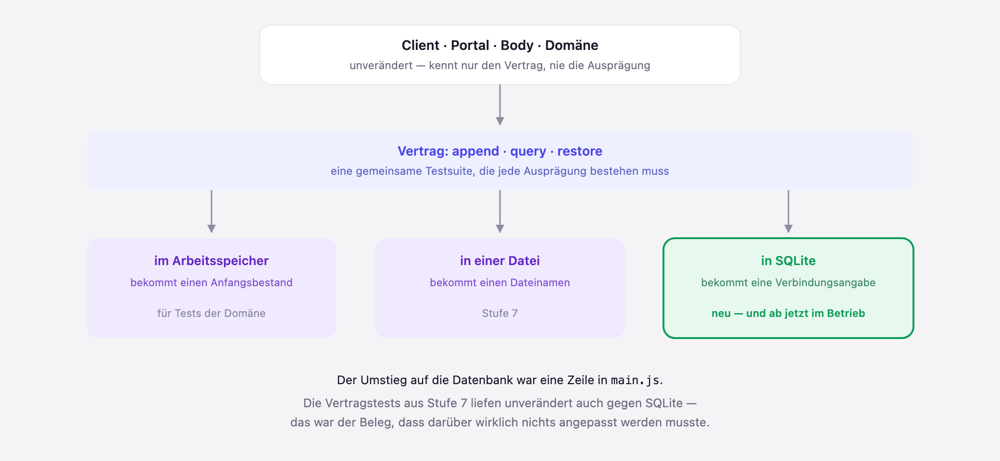

# Stufe 08 — Echte Datenbank: SQLite

Übergeordneter Kontext: [Projekt.md](Projekt.md).

## Ziel dieser Stufe

Die Ereignisse liegen nicht mehr in einer JSON-Datei, sondern in einer SQLite-Datenbank. Nach
außen ändert sich dadurch nichts — die Oberfläche sieht aus wie vorher und kann dasselbe. Es
lohnt sich trotzdem, und diese Stufe handelt davon, warum.

## Zuerst ein Argument, das nicht zählt

Naheliegend wäre: "eine Datenbank ist schneller". Der Datei-Store aus Stufe 7 schrieb bei *jedem*
Ereignis den *kompletten* Bestand neu — beim tausendsten Kauf also tausend Ereignisse, um eines
hinzuzufügen. Entsprechend brutal fällt der Vergleich aus.

Nur ist das kein Argument gegen Dateien, sondern gegen *diese* Umsetzung. Ein Ereignisspeicher in
einer Datei muss nicht alles neu schreiben; er kann eine Zeile anhängen und die vorherigen
unangetastet lassen. Gemessen mit genau so einer Variante:

| Ereignisse | Datei: alles neu | Datei: nur anhängen | SQLite |
|---:|---:|---:|---:|
| 1.000 | 139 ms | **25 ms** | 45 ms |
| 4.000 | 1.690 ms | **97 ms** | 132 ms |
| 8.000 | 6.505 ms | **208 ms** | 265 ms |
| 16.000 | 26.203 ms | **428 ms** | 512 ms |

Die anhängende Datei ist nicht nur ebenbürtig, sondern **schneller als die Datenbank** — sie tut
ja auch weniger: kein Index, keine Transaktionsführung. Geschwindigkeit beim Erfassen ist damit
kein Grund für eine Datenbank. Das musste zuerst vom Tisch, sonst stünde der Rest auf einer
falschen Begründung.

Dasselbe gilt fürs Lesen, solange man den Ansatz nicht überfordert: Wer alle Ereignisse im
Arbeitsspeicher hält, beantwortet jede Abfrage sofort. Die Frage ist nicht, ob das schnell ist,
sondern wie lange es das bleibt — dazu weiter unten.

(Die dritte Spalte erklärt nebenbei, warum SQLite überhaupt mithalten kann: Im WAL-Modus hängt es
Änderungen intern ebenfalls nur ans Ende einer Datei an, statt mitten in der Datenbank
herumzuschreiben. Es macht also dasselbe wie die anhängende Datei — nur zusätzlich noch die
Buchführung, die die folgenden Abschnitte ermöglicht.)

## Was eine Datenbank wirklich besser kann

### Nicht alles muss in den Arbeitsspeicher

Auch die Leseseite war in der Messung oben zu gut weggekommen, und zwar aus einem Grund, der die
eigentliche Grenze markiert: Der Datei-Store hält *sämtliche* Ereignisse im Arbeitsspeicher. Er
liest die Datei einmal beim Start komplett ein und schreibt danach nur noch mit. Solange alles
hineinpasst, ist er dadurch beim Lesen unschlagbar — er muss ja nichts suchen.

Nur trägt das nicht weit. Derselbe Bestand, einmal mit 200.000 Ereignissen (25 MB als Datei):

| | Start | zusätzlicher Arbeitsspeicher | eine Verlaufsabfrage |
|---|---:|---:|---:|
| Datei: nur anhängen | 79 ms | **126 MB** | 1,0 ms |
| SQLite | **1 ms** | **3 MB** | 0,8 ms |

Aus 25 MB auf der Platte werden 126 MB im Speicher — Objekte brauchen mehr Platz als Text. Und
beides wächst mit dem Bestand: doppelt so viele Ereignisse, doppelt so lange Startzeit, doppelt so
viel Speicher. Die Datenbank bleibt konstant, weil sie eben *nicht* alles hereinholt.

Damit ist die Grenze benannt: Der Datei-Store ist schnell, solange der ganze Bestand in den
Speicher passt und ein einzelner Prozess ihn besitzt. Beides sind Annahmen, die eine Anwendung
irgendwann verlässt — und dann trägt der Ansatz nicht mehr, egal wie geschickt er gebaut ist.

### Abfragen beantwortet die Datenbank

Der Verlauf einer Position braucht nur die Ereignisse *dieses* Wertpapiers. Beim Datei-Store heißt
das: durch alles durchgehen, was im Speicher liegt. Die Datenbank hat einen Index darauf und liest
nur die passenden Zeilen — ohne den Rest je anzufassen. Bei 200.000 Ereignissen sind beide noch
etwa gleich schnell; der Unterschied ist, dass der eine dafür 126 MB bereithalten muss und der
andere nicht. Was die Domäne verlangt, hat sich dabei kein Stück geändert, nur wer die Arbeit
macht.

### Mehrere dürfen gleichzeitig ran

Das ist der Vorteil, der am wenigsten nach Technik klingt und am meisten ausmacht — und hier
verlieren beide Datei-Varianten, jede auf ihre Weise. Zwei Prozesse schreiben gleichzeitig je 150
Ereignisse, etwa der Server und daneben ein Skript:

| | Ergebnis |
|---|---|
| Datei: alles neu | **150 von 300** — die Hälfte weg |
| Datei: nur anhängen | 300 von 300, aber **150 doppelt vergebene Nummern** |
| SQLite | **300 von 300**, alle Nummern eindeutig |

Beim Neuschreiben überschreibt schlicht der Letzte den Anderen. Die anhängende Variante verliert
zwar nichts — aber beide Prozesse vergeben dieselben laufenden Nummern, weil jeder für sich
zählt. Das ist der unangenehmere Fehler: Es sieht vollständig aus, und die Reihenfolge, auf die
sich die Domäne bei gleichem Datum verlässt, ist trotzdem kaputt. Niemand meldet das.

Genau hier liegt der Unterschied. Die Nummer zu vergeben und die Zeile zu schreiben ist bei der
Datenbank *ein* Vorgang, den sie gegen andere abgrenzt. Außerhalb einer Datenbank müsste man
diese Absprache selbst bauen — und wäre damit dabei, eine zu schreiben.

Auch das ging allerdings nicht von allein. Der erste Entwurf verlor genauso Daten: Der zweite
Schreiber lief in eine Sperre und gab sofort auf. Zwei Einstellungen haben aus "liegt in einer
Datenbank" ein "mehrere dürfen gleichzeitig ran" gemacht — der WAL-Modus und eine Wartezeit, damit
ein Schreiber kurz wartet statt aufzugeben. Und ein zweiter Anlauf war nötig, weil ihre
Reihenfolge zählt: Das Umschalten auf WAL braucht selbst kurz eine Sperre und scheiterte, solange
die Wartezeit erst danach gesetzt wurde.

### Halb passiert es nicht mehr

Beim Import wird der gesamte Bestand ersetzt. Geht dabei etwas schief, war das bei der Datei ein
echtes Risiko: Ein abgebrochener Schreibvorgang hinterlässt eine abgeschnittene Datei. Die
Datenbank führt das als Transaktion aus — entweder gilt der neue Bestand vollständig, oder es
bleibt beim alten. Ein halb ersetztes Depot kann es nicht mehr geben. Das ist mit einem Test
abgesichert, der den Import absichtlich scheitern lässt.

### Man kommt an die Daten heran

Die Ereignisse sind jetzt abfragbar, ohne die Anwendung zu starten. Für eine Frage wie "wie viele
Käufe pro Broker?" braucht es kein neues Feature — eine Abfrage genügt. Das ist die stille
Eigenschaft, die eine Datenbank von einem Dateiformat unterscheidet: Die Daten gehören nicht mehr
allein dem Programm, das sie geschrieben hat.

## Warum das so wenig Arbeit war



Der Umbau bestand im Kern aus einer neuen Datei und einer geänderten Zeile. Das liegt an zwei
Entscheidungen aus den Stufen davor:

**Der Event-Store ist selbst für seine Speicherung zuständig** (Stufe 7). Weil niemand außerhalb
weiß, wohin geschrieben wird, gibt es auch niemanden, den ein Wechsel des Mediums betrifft. Hätte
noch ein Provider daneben gestanden, der den Bestand wegschreibt, wäre jetzt beides anzufassen
gewesen — und die Frage aufgekommen, wer denn nun speichert.

**Es gibt einen Vertrag, und er wird geprüft** (ebenfalls Stufe 7). Die gemeinsame Testsuite für
alle Ausprägungen war ursprünglich als Fleißarbeit gedacht. In dieser Stufe hat sie sich bezahlt
gemacht: Der neue Store wurde daran angeschlossen, und die Suite lief ohne eine einzige Änderung
durch. Damit war belegt — nicht gehofft —, dass Domäne, Body, Portal und Client nichts merken.

Die Reihenfolge ist dabei kein Zufall. Der Vertrag entstand, als es zwei Ausprägungen gab, bei
denen man ihn noch für Zierrat halten konnte. Wer ihn erst schreibt, wenn er gebraucht wird, hat
ihn nicht, wenn er gebraucht wird.

## Die Daten mussten mit umziehen

Ein bestehendes Depot in einer JSON-Datei wird nicht von selbst zur Datenbank. Dafür gibt es
einen eigenen Befehl:

```bash
deno task migriere
```

Bewusst ein eigener Schritt und keine Automatik beim Serverstart: Ein Server, der beim Hochfahren
stillschweigend Bestände verschiebt, tut zu viel, und man merkt es erst, wenn etwas schiefging.
So ist es ein Vorgang, den man auslöst und dessen Ergebnis man abliest. Er bricht ab, wenn die
Datenbank schon Daten enthält, und die JSON-Datei bleibt unangetastet liegen.

## Ergebnis

Kein neues Bild der Oberfläche — sie ist unverändert, und das ist der Punkt. Sichtbar ist das
Ergebnis woanders: Die Ereignisse liegen in `server/data/depot.sqlite`, eine Tabelle mit einer
Zeile je Ereignis, abfragbar mit SQL. Das bestehende Depot ist vollständig übernommen, der
Depotwert vor und nach dem Umzug identisch.

SQLite ist dabei kein Server, sondern eine Datei — nichts zu installieren, nichts zu starten. Und
`node:sqlite` bringt Deno mit, sodass die Anwendung weiterhin ohne eine einzige externe
Abhängigkeit auskommt.

## Mitgenommene Lektionen

- Eine Datenbank ist nicht "eine schnellere Datei". Beim reinen Erfassen ist eine anhängende
  Datei sogar schneller, und beim Lesen ist sie es auch — solange alles in den Arbeitsspeicher
  passt und ein einziger Prozess zugreift. Der Unterschied liegt nicht in der Geschwindigkeit,
  sondern darin, welche Annahmen man aufgeben darf, ohne neu bauen zu müssen.
- Ein Vergleich ist nur so ehrlich wie die schwächere Seite gut gebaut ist. Die erste Messung
  stellte der Datenbank eine absichtlich einfach gehaltene Datei-Variante gegenüber und sagte
  damit über Datenbanken nichts aus. Wer für seine eigene These misst, sollte der Gegenseite die
  beste Umsetzung zugestehen.
- Der gefährlichere Fehler ist der leise. Datenverlust fällt auf; doppelt vergebene laufende
  Nummern sehen aus wie ein vollständiger Bestand.
- Dieselbe Technik kann je nach Einstellung das Gegenteil dessen tun, was man erwartet — ohne WAL
  war die Datenbank langsamer als die Datei und verlor genauso Daten. Nachmessen schlägt annehmen.
- Der Aufwand einer Änderung wird lange vorher entschieden. Dass diese Stufe klein war, ist das
  Ergebnis von zwei Entscheidungen aus Stufe 7 — und die sahen damals nach Mehrarbeit ohne
  unmittelbaren Nutzen aus.
