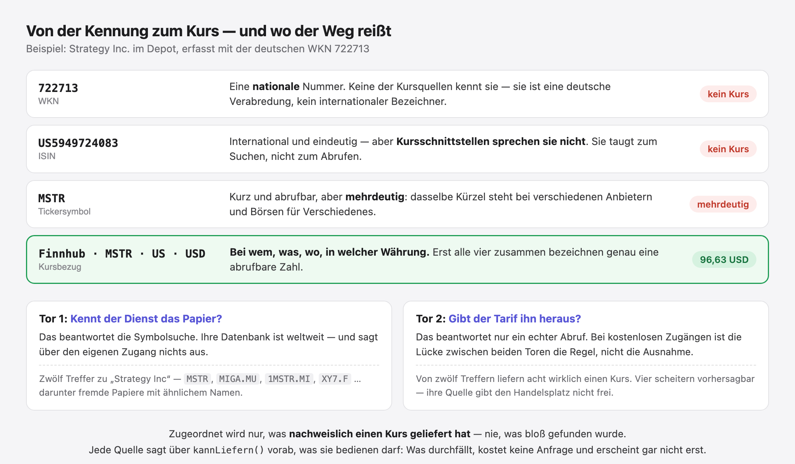
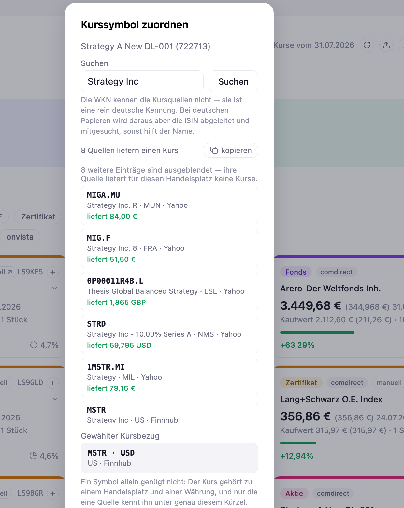

# Stufe 09 — Externer HTTP-Service: Kurse von fremden Diensten

Übergeordneter Kontext: [Projekt.md](Projekt.md).

## Ziel dieser Stufe

Die Kurse im Depot wurden bisher von Hand eingetragen. Ab jetzt holt die Anwendung sie sich
selbst — auf Knopfdruck, von öffentlichen Kursdiensten. Grüner Punkt an der Position, wenn es
geklappt hat, roter, wenn nicht, und daneben steht, wann zuletzt aktualisiert wurde.

Bewusst kein automatischer Abruf im Hintergrund: Der Nutzer drückt, die Anwendung holt. Ein
Programm, das ungefragt fremde Dienste befragt, verbraucht Anfragekontingente und erzeugt Last,
von der niemand weiß, warum sie entsteht.

## Warum diese Stufe erst jetzt möglich ist

Das ist der technische Kern, und er wird leicht übersehen: **Ohne den Server aus Stufe 7 gäbe es
diese Stufe nicht.** Nicht, weil es bequemer wäre — sondern weil eine Browser-Seite fremde
Dienste gar nicht aufrufen darf.

Der Browser lässt eine Seite nur dann die Antwort eines fremden Servers lesen, wenn dieser Server
das ausdrücklich erlaubt: mit dem Antwort-Header `Access-Control-Allow-Origin`. Fehlt er, bricht
der Browser den Zugriff ab — die Anfrage geht sogar raus, aber die Antwort bekommt die Seite nie
zu sehen. Das ist die Same-Origin-Policy, und sie ist eine Regel *des Browsers*. Ein Server hat
sie nicht; er darf jeden anrufen.

Aus der laufenden App heraus gemessen, mit `fetch` von `http://localhost:8000`:

| Dienst | im Browser | Grund |
|---|---|---|
| **Yahoo** (Kurse und Suche) | **blockiert** | sendet kein `Access-Control-Allow-Origin` |
| Finnhub | durchgelassen | `Access-Control-Allow-Origin: *` |
| Twelve Data | durchgelassen | `Access-Control-Allow-Origin: *` |
| Frankfurter (Wechselkurse) | durchgelassen | `Access-Control-Allow-Origin: *` |

Bemerkenswert ist nicht, dass CORS *alles* blockiert — es blockiert genau **einen** der vier
Dienste. Nur ist das ausgerechnet der, der als einziger das ganze Depot abdeckt (siehe unten).
Und daran ist nichts zu machen: Ob ein Dienst diesen Header setzt, ist seine Entscheidung, sie
kann sich jederzeit ändern, und auf der Clientseite gibt es dagegen kein Mittel. Eine Architektur,
die davon abhängt, hängt an einer fremden Konfiguration.

Der zweite Grund wiegt genauso schwer: Die beiden Dienste, die durchkämen, verlangen einen
API-Schlüssel. Aus dem Browser aufgerufen müsste der Schlüssel im Seitenquelltext stehen — und
wäre damit für jeden Besucher lesbar. Ein Schlüssel im Clientcode ist ein öffentlicher Schlüssel.
So bleiben `FINNHUB_API_KEY` und `TWELVE_DATA_API_KEY` in der `.env` des Servers; der Browser
erfährt sie nie.

### Dasselbe Muster wie beim Dateisystem

Das ist nicht das erste Mal, dass die Sandbox des Browsers eine Stufe erzwungen hat. Genau so war
es beim Speichern:

| Ressource | im Browser | Lösung |
|---|---|---|
| Dateisystem (Stufe 5) | nur über einen Dateidialog, den der Nutzer bedient | — |
| Ereignisdatei (Stufe 7) | gar nicht | Server schreibt, Client ruft ihn an |
| Datenbank (Stufe 8) | gar nicht | Server hält die Verbindung |
| Fremder HTTP-Dienst (Stufe 9) | teils blockiert, Schlüssel wären öffentlich | Server ruft an, Client ruft ihn an |

Drei Stufen, dieselbe Ursache: Eine Browser-Seite ist absichtlich eingesperrt. Sie darf nicht ans
Dateisystem, nicht an eine Datenbank, nicht ungefragt zu fremden Servern. Und dreimal dieselbe
Antwort: Die Ressource kommt hinter das eigene Backend, und der Client redet nur noch mit dem.

Dass das jedes Mal wenig Arbeit war, liegt an der Bauform aus Stufe 4. Für den Body ist ein
fremder HTTP-Dienst **derselbe Bausteintyp** wie früher der Browser-Speicher und heute die
Datenbank: ein xProvider, ein nach hinten gerichteter Adapter, der eine Ressource kapselt. Der
Body weiß nicht, ob hinter `kurseAbrufen(["MSTR"])` eine Datei, eine Datenbank oder eine Leitung
nach Amerika liegt.

Verändert hat sich dabei nur eines — und darum geht der Rest dieser Stufe: **die Art, wie so ein
Provider scheitern kann.** Eine Datei ist da oder nicht. Ein fremder Dienst ist langsam, sperrt
aus, antwortet mit dem Falschen oder ist eine Stunde lang weg.

## Worum es dann eigentlich ging

Der Plan für diese Stufe hieß „Umgang mit externen Abhängigkeiten, Fehlerbehandlung und Rate
Limits". Das klang nach HTTP. HTTP war der einfachste Teil — der Kursabruf selbst ist ein `fetch`
und zehn Zeilen Auswertung.

Fast die gesamte Arbeit ging in eine einzige Frage: **Woher weiß ein fremder Dienst, welches
Papier ich meine?**



Die Anwendung führte ihre Positionen unter der WKN — dem Kürzel vom deutschen Depotauszug. Keine
der Kursquellen kennt sie: Sie ist eine nationale Verabredung. Die ISIN ist international, aber
Kursschnittstellen sprechen sie nicht; sie taugt zum *Suchen*, nicht zum *Abrufen*. Abrufbar ist
das Tickersymbol — nur ist es mehrdeutig: `MSTR` heißt bei Yahoo etwas anderes als bei Twelve
Data, und dasselbe Papier trägt in München, Frankfurt und Mailand jeweils ein anderes Kürzel.

Daraus wurde die zentrale Erkenntnis dieser Stufe, und sie hat einen Namen im Code bekommen:

> Ein Kurs ist nicht durch ein Symbol bestimmt, sondern durch **Quelle, Symbol, Handelsplatz und
> Währung** zusammen. Erst alle vier bezeichnen genau eine abrufbare Zahl.

Der `kursbezug` ist deshalb kein Feld, sondern ein Verbund — und er hängt **je Position** fest.
Ein früherer Entwurf fragte bei jedem Abruf reihum alle Quellen durch, bis eine antwortete. Das
sah robust aus und war das Gegenteil: Je nach Tageslaune der Dienste hätte dieselbe Position mal
den Münchner, mal den Mailänder Kurs bekommen — 84,00 € oder 79,16 €, ohne dass irgendwo stünde,
warum. Eine Position braucht *eine* Quelle, die verlässlich ist, keine Auswahl an Zufällen.

## Zwei Tore, nicht eines

Der zweite große Zeitfresser war ein Unterschied, den man erst im Betrieb bemerkt:

| | Frage | Antwort von |
|---|---|---|
| **Tor 1** | Kennt der Dienst das Papier? | der Symbolsuche — ihre Datenbank ist weltweit |
| **Tor 2** | Gibt der Tarif es heraus? | nur ein echter Abruf |

Bei kostenlosen Zugängen ist die Lücke zwischen beiden Toren die **Regel**. Twelve Data findet
zuverlässig zu jeder ISIN das passende Symbol samt Handelsplatz und Währung — und liefert im
kostenlosen Tarif für kein einziges europäisches Papier einen Kurs. Gemessen über acht
Handelsplätze:

| | US | XETRA | Stuttgart / Hamburg / Frankfurt | London | Mailand |
|---|:-:|:-:|:-:|:-:|:-:|
| **Yahoo** | ✓ | ✓ | ✓ | ✓ | ✓ |
| **Finnhub** | ✓ | ✗ 403 | ✗ 403 | ✗ 403 | ✗ 403 |
| **Twelve Data** | ✓ | ✗ 404 | ✗ 404 | ✗ 404 | ✗ 404 |

Ein Dienst ohne Vertrag und ohne Zusage deckt also alles ab, während die beiden mit Schlüssel und
Registrierung an der Landesgrenze enden. Verlässlichkeit heißt hier „liefert tatsächlich", nicht
„hat es zugesichert". Und es ist derselbe Dienst, den der Browser nicht aufrufen dürfte — die
beiden Messungen zusammen sind das Argument für den Server.

## Ein Erfolg, der keiner ist

Ein fremder Dienst kann auf dreierlei Weise scheitern, und nur zwei davon sieht man:

1. Er antwortet nicht — Zeitlimit, 502, Netz weg.
2. Er sagt Nein — 403, 404, 429.
3. **Er antwortet mit dem Falschen, und zwar mit HTTP 200.**

Der dritte Fall ist der teure. Zwei Beispiele aus dieser Stufe: Für einen ETF wurde über eine
falsch abgeleitete ISIN das Symbol `ADS` — Adidas — gefunden und beinahe zugeordnet. Und Twelve
Data führt Symbole ohne Handelsplatz-Endung: In der Suche steht `SAP` an der XETRA, der Abruf
desselben Kürzels liefert das New Yorker Zweitlisting, 180,88 USD statt 155,64 EUR. Beides
kommt als Erfolg zurück; ab dem nächsten Abruf stünde eine falsche Zahl im Depot, ohne dass
irgendetwas darauf hinwiese.

Daraus wurde die Regel, die jetzt überall gilt:

> **Zugeordnet wird nur, was nachweislich einen Kurs geliefert hat.**

Vor jeder Zuordnung — der automatischen beim Erfassen wie der von Hand gewählten — steht ein
echter Probeabruf, und zusätzlich muss der Name plausibel passen. Im Zweifel ordnet die Anwendung
*nicht* zu und sagt das. Keine Zuordnung ist unangenehm; eine stillschweigend falsche ist
schlimmer, weil sie richtig aussieht.

## Wissen über einen fremden Dienst gehört in seinen Adapter

Warum muss man Kandidaten überhaupt einzeln durchprobieren, wenn vorher feststeht, dass die
Hälfte scheitert? Sie steht wirklich vorher fest: Ein Finnhub-Kandidat an einer deutschen Börse
wird mit 403 beantwortet — immer.

Der Vertrag jeder Kursquelle hat deshalb zwei Angaben bekommen:

```js
// finnhubProvider.js
const verlaesslichkeit = 0.6;                     // gemessen, nicht geschätzt
const kannLiefern = (t) => istUsBoerse(t.boerse) || !t.symbol.includes(".");
```

`kannLiefern` beantwortet Tor 2, soweit es sich vorhersagen lässt — ohne eine einzige Anfrage.
`verlaesslichkeit` ordnet den Rest vor, damit der aussichtsreichste Kandidat zuerst geprüft wird.

Entscheidend ist, **wo** das steht: im Adapter des jeweiligen Dienstes, nicht in einer zentralen
Tabelle. Es ist Wissen über *diesen* Dienst; wer ihn austauscht, tauscht das Wissen mit aus. Eine
zentrale Liste hätte man beim Austausch vergessen.

Was daraus folgt, ist keine Optimierung, sondern eine andere Bedeutung der Trefferliste: Sie
zeigt nicht mehr, was gefunden wurde, sondern **was abrufbar ist**. Vorhersagbar aussichtslose
Kandidaten kosten keine Anfrage und erscheinen gar nicht erst; wer die Probe nicht besteht,
verschwindet wieder.

## Warum es zwei Verträge sind und nicht einer

Suchen und Kurse holen können dieselben Anbieter. Trotzdem sind es im Code zwei getrennte
Bausteine mit getrennten Verträgen. Der Anlass war eine technische Beobachtung: Die verkettete
Fassung braucht zwei *verschiedene* Kompositionsregeln. Kurse werden gesucht, bis einer gefunden
ist — mehr braucht niemand. Bei der Suche ist es umgekehrt: Da will man alles, was mehrere
Quellen kennen, denn erst die Auswahl über Handelsplätze hinweg macht sie brauchbar. Zwei
Kompositionsregeln in einer Schnittstelle heißt: es sind zwei.

Bezahlt gemacht hat sich das erst, als die Messung vorlag. Twelve Data ist als Kursquelle für
dieses Depot **wertlos** und als Symbolsuche **die beste der drei** — sie kennt ISINs und nennt
Handelsplatz und Währung dazu. Bei Finnhub dasselbe Bild. Weil beides getrennt ist, darf ein
Dienst in der einen Rolle bleiben und aus der anderen fliegen, ohne dass etwas umgebaut werden
muss. Hätte ein Anbieter beides in einem Vertrag erfüllen müssen, wäre er entweder ganz draußen
oder als halb kaputte Kursquelle drin.

## Was die Wirklichkeit vorgibt

Von zwölf Positionen im Depot lassen sich **fünf** automatisch abrufen. Die sieben anderen — sechs
Zertifikate eines einzelnen Emittenten und zwei kleine Nebenwerte — führt keine der Quellen. Das
ist keine Lücke in der Software, sondern eine Eigenschaft der Welt.

Software, die das verschweigt, wird unehrlich: Sie zeigt einen Kurs, ohne zu sagen, wie alt er
ist. Deshalb kennt eine Position jetzt drei Zustände:

| Zustand | Bedeutung |
|---|---|
| **automatisch** | Kursbezug vorhanden und belegt — wird beim Aktualisieren mitgeholt. |
| **manuell** | Es gibt keine Quelle. Bewusst so, keine offene Aufgabe. |
| **offen** | Die Angaben fehlen noch und ließen sich nachtragen. |

Der Unterschied zwischen „manuell" und „offen" ist der zwischen einer Entscheidung und einer
Aufgabe. Ohne ihn stünde eine Liste mit sieben Mahnungen da, von denen keine zu erledigen ist.

Bei manuellen Positionen steht das Alter des Kurses dabei, und ab **90 Tagen** gilt er als
veraltet — nicht ab einer Woche. Die Grenze richtet sich nach dem Nutzer, nicht nach dem technisch
Möglichen. Zusätzlich lässt sich eine Nachschlage-Adresse hinterlegen, die mit einem Klick
dorthin führt, wo der Kurs von Hand abzulesen ist.

Wo die Automatik nicht entscheiden kann, legt ein Kopierknopf die Trefferliste als Text bereit —
samt Zusammenhang, Frage und **dem Kurs, den jeder Kandidat geliefert hat**. Der Kurs ist die
eigentliche Entscheidungshilfe: 84,00 € und 79,16 € und 97,74 USD sind erkennbar dasselbe Papier,
1,01 € ist es erkennbar nicht. Ein Datenauszug ohne Zahlen hätte die Frage nur weitergereicht.

## Anfragelimits und Ausfälle sind Normalbetrieb

Die kostenlosen Zugänge zählen Anfragen, nicht Kurse — bei Twelve Data acht pro Minute. Zwölf
Positionen einzeln abzufragen wäre sofort am Limit. Daraus vier Entwurfsentscheidungen:

- **Ein Aufruf für viele Symbole**, wo der Dienst das kann. Die Grenze zählt Anfragen.
- **Nacheinander statt gleichzeitig.** Ein Schwall paralleler Anfragen ist der sicherste Weg,
  ausgesperrt zu werden.
- **Höchstens acht Proben** in der Trefferliste. Der Rest wird erst geprüft, wenn er angeklickt
  wird — dann kostet die Prüfung nur dort etwas, wo Interesse besteht.
- **Ein Zeitlimit je Quelle**, damit ein hängender Dienst nicht die ganze Aktualisierung aufhält.

Dass das kein theoretisches Thema ist, hat sich während der Arbeit von selbst gezeigt: Finnhub
war eine knappe Stunde lang komplett ausgefallen (502 auf allen Endpunkten), und Yahoo hat auf zu
viele Messabrufe hin mit 429 geantwortet. Beides mitten in der Entwicklung, ohne Zutun. Ein
Fehlschlag einzelner Papiere steht deshalb im Bericht, nicht im Statuscode: Ein Abruf, bei dem
zehn von zwölf klappen, ist kein gescheiterter Aufruf.

Und noch ein Dienst kam dazu: Fremdwährungskurse werden in Euro umgerechnet — ein Dreizeiler und
eine weitere Abhängigkeit. Fällt der Wechselkursdienst aus, gibt es keinen Kurs, obwohl der
Kursdienst geliefert hat. Deshalb bevorzugt die Anwendung bei sonst gleichwertigen Kandidaten
eine Euro-Notierung: nicht wegen der Genauigkeit, sondern weil ein Dienst weniger im Spiel ist.

## Umwege

Vier Korrekturen, die im Code Spuren hinterlassen haben:

- **Twelve Data war meine Empfehlung als Hauptquelle** — begründet mit der Reichweite seiner
  Symboldatenbank. Von der auf den Kursabruf zu schließen war falsch: Die Datenbank ist weltweit,
  der Tarif ist es nicht. Gemessen war eine Eigenschaft, behauptet eine andere.
- **Der Namensvergleich kannte SAP nicht.** Wörter unter vier Zeichen galten als bedeutungslos;
  für „SAP SE" blieb damit kein einziges übrig. Untergrenze auf drei Zeichen, Rechtsformen (AG,
  SE, plc, Inc …) dafür in die Liste der nichtssagenden Wörter.
- **Der comdirect-Export enthält keine ISIN-Spalte.** Sie aus WKN und Namen abzuleiten führt
  direkt zum Adidas-Fall. Für deutsche Emissionen lässt sie sich rechnen (`DE000` + WKN +
  Prüfziffer), sonst hilft nur der Name.
- **„EES" heißt Energy Sector, nicht ESG.** Ein falsch gelesenes comdirect-Kürzel brachte einer
  ETF-Position das Symbol eines ganz anderen iShares-Fonds ein — 77 € statt 15,87 €. Aufgefallen
  ist es am Probeabruf, weil die Größenordnung nicht zum Depotauszug passte. Genau dafür stehen
  die Kurse jetzt in der Liste.

## Ergebnis



Ein Knopf oben rechts holt die Kurse aller automatischen Positionen, dreht sich, während er
wartet, und setzt danach je Position einen grünen oder roten Punkt. Daneben steht das Datum des
jüngsten Kurses — kein zusätzlich gespeicherter Zeitpunkt, der mit der Wirklichkeit
auseinanderlaufen könnte, sondern eine Auskunft aus dem Bestand selbst.

Der Zuordnungsdialog zeigt zu jedem Kandidaten den Kurs, den er wirklich geliefert hat. Was nichts
liefert, steht nicht drin.

209 Tests laufen durch. Die neuen halten fest, was über die Grenzen der Zugänge gemessen wurde —
ändert ein Anbieter seinen Tarif, schlagen sie fehl. Genau das sollen sie: Diese Zahlen sind
gemessen, nicht ewig gültig.

## Mitgenommene Lektionen

- **Ein Backend ist die Voraussetzung dafür, fremde Dienste überhaupt aufzurufen.** Der Browser
  sperrt eine Seite absichtlich ein — kein Dateisystem, keine Datenbank, und fremde Server nur,
  wenn die selbst zustimmen. Dreimal dieselbe Ursache in drei Stufen, dreimal dieselbe Antwort:
  Die Ressource kommt hinter das eigene Backend.
- Ob CORS im Weg steht, entscheidet der fremde Dienst, nicht man selbst — und er kann seine
  Meinung jederzeit ändern. Von den vier hier benutzten Diensten blockiert genau einer; es ist
  der wichtigste. Auf so etwas eine Architektur zu setzen heißt, sie an eine fremde Konfiguration
  zu hängen.
- Ein API-Schlüssel im Clientcode ist ein öffentlicher Schlüssel. Auch ein Dienst, der CORS
  erlaubt, gehört deshalb hinter den eigenen Server.
- Für den Body ist ein fremder HTTP-Dienst derselbe Bausteintyp wie eine Datei oder eine
  Datenbank: ein xProvider. Neu sind nicht die Aufrufe, neu sind die **Arten zu scheitern** — und
  die gehören in den Adapter, nicht in die Fachlogik.
- Ein externes System hat eigenes Vokabular. Die schwerste Aufgabe einer Anbindung ist meist die
  **Identität**: Wie heißt bei denen das, was bei mir so heißt? Kennungen, die im eigenen Haus
  eindeutig sind, sind es draußen selten.
- „Kennt es" und „gibt es heraus" sind zwei verschiedene Fragen. Wer nur die erste stellt, baut
  eine Oberfläche voller Sackgassen, die erst beim Benutzen auffallen.
- Ein Ergebnis, das wie ein Erfolg aussieht, ist gefährlicher als ein Fehler. Ein 404 wird
  behandelt; ein falscher Kurs mit HTTP 200 steht jahrelang im Depot. Prüfen heißt deshalb:
  dasselbe tun, was später im Betrieb passiert — Metadaten anschauen genügt nicht.
- Wissen über einen fremden Dienst gehört in dessen Adapter, nicht in eine zentrale Tabelle. Wer
  den Dienst austauscht, tauscht sein Wissen mit aus.
- Wenn zwei Fähigkeiten desselben Anbieters unterschiedlich zusammengesetzt werden müssen, sind
  es zwei Verträge. Der Nutzen zeigt sich erst, wenn ein Anbieter in einer Rolle taugt und in der
  anderen nicht — und dann ist es zu spät, sie noch zu trennen.
- Abdeckung ist eine Eigenschaft der Welt, nicht des Codes. Was nicht geht, muss die Oberfläche
  benennen — und dabei unterscheiden zwischen „gibt es nicht" und „fehlt noch".
- Jede Umrechnung, jede Anreicherung, jeder Zusatzdienst ist eine weitere Sache, die ausfallen
  kann.
