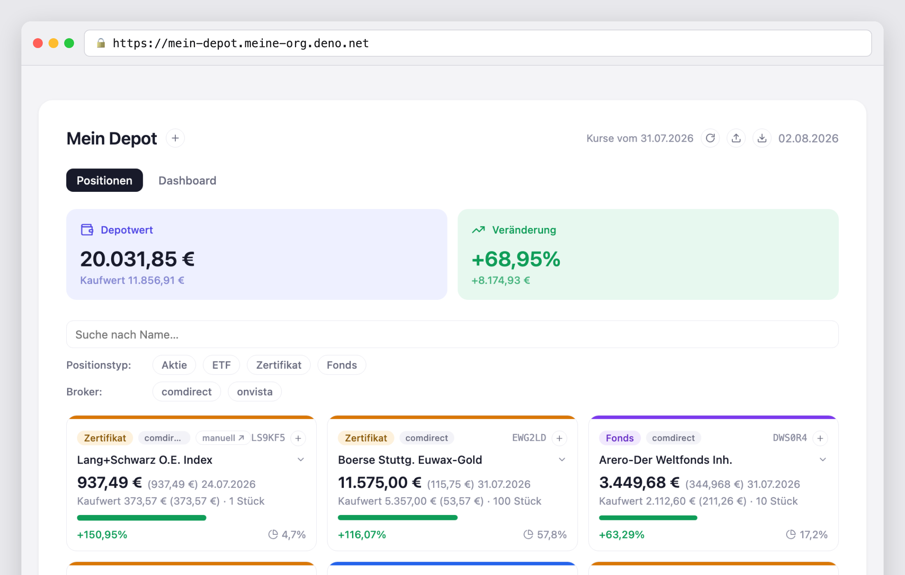

# Stufe 12 — Deployment ins Web

Übergeordneter Kontext: [Projekt.md](Projekt.md).

## Ziel dieser Stufe

Die Anwendung läuft nicht mehr nur auf dem eigenen Rechner, sondern unter einer öffentlichen
Adresse im Internet — bei Deno Deploy in der Form:

**`https://mein-depot.meine-org.deno.net`**

Kein `deno task serve` mehr, kein `localhost:8000`, kein eingeschalteter Laptop. Die Adresse
funktioniert, während dieser Text entsteht — und während der Rechner, auf dem sie gebaut wurde,
ausgeschaltet ist.

## Was damit gewonnen ist

### Die Anwendung existiert unabhängig von einem Gerät

Das ist der eigentliche Sprung, und er ist größer, als er klingt. Bisher war „die Anwendung
läuft" gleichbedeutend mit „auf diesem Rechner läuft gerade ein Prozess". Zuklappen, neu starten,
Kaffee holen — weg. Jetzt gilt: Die Anwendung ist da, unabhängig davon, was der Entwickler gerade
tut. Sie hat aufgehört, ein Prozess auf einem Schreibtisch zu sein, und ist ein *Dienst* geworden.

Genau das war der ganze Sinn von Stufe 11. Dort stand als Begründung für die entfernte Datenbank:
"Ein Server, der irgendwo in der Cloud deployt wird, hat oft gar keine Platte, die ihm allein
gehört und die einen Neustart übersteht. SQLite bräuchte genau das. Postgres nicht." Diese Stufe
ist die Einlösung — der Nutzen, der dort noch auf Vorschuss lief, fällt hier an.

### Vom Prototyp zum Benutzbaren

Solange etwas nur lokal läuft, ist es ein Programmierprojekt. Ab einer Adresse ist es etwas, das
man benutzt: vom Telefon in der Bahn, vom Rechner im Büro, vom Tablet auf dem Sofa. Für einen
Depot-Tracker ist das kein Detail, sondern der Unterschied zwischen "ich müsste mal nachschauen,
wenn ich zu Hause bin" und "ich schaue nach".

Die Oberfläche hat sich dafür nicht um eine Zeile geändert. Sie war seit Stufe 7 ein Client, der
mit einem Server über HTTP spricht — dass dieser Server jetzt woanders steht, merkt sie nicht.
Auch das ist ein nachträglich eingelöster Vorschuss: Die Client/Server-Trennung sah damals nach
Umbau ohne sichtbaren Gewinn aus.

### Andere können es sehen

Eine Adresse lässt sich weitergeben. Das ist die Voraussetzung für alles, was mit anderen
Menschen zu tun hat — Feedback einholen, etwas vorführen, jemanden mitbenutzen lassen. Bis hierher
war jede Demonstration ein "komm mal an meinen Rechner".

Genau hier wird allerdings auch sichtbar, was **noch fehlt**: Die Anwendung ist öffentlich
erreichbar, aber es gibt nur *einen* API-Schlüssel für *ein* Depot. Wer den Schlüssel hat, sieht
alles; wer ihn nicht hat, sieht nichts. Ein zweiter Nutzer mit eigenem Depot ist damit nicht
möglich. Das ist keine Nachlässigkeit, sondern die Aufgabe der Stufen 13 (Auth) und 16
(Multi-Tenant) — aber es ist jetzt zum ersten Mal ein *konkretes* Problem statt eines
theoretischen: Vorher gab es niemanden, der hätte zugreifen können.

### Der Betrieb wird zu einem eigenen Thema

Eine deployte Anwendung wirft Fragen auf, die eine lokale nie stellt. Läuft sie noch? Was hat sie
protokolliert? Welche Version ist gerade aktiv? Die Plattform beantwortet das über dieselbe CLI,
mit der auch deployt wird — Anwendungsstatus, Liste aller bisherigen Revisionen, Protokoll der
laufenden Instanz.

Dass jede Revision eine eigene Kennung behält, ist dabei mehr als Buchhaltung: Es ist dieselbe
Idee wie beim Event-Log der Anwendung und bei der Git-Historie (Stufe 10) — nichts wird
überschrieben, es kommt nur etwas dazu. Ein Deployment, das sich als Fehler herausstellt, wird
nicht repariert, sondern durch das nächste ersetzt, während das vorherige nachweisbar bleibt.

## Was ein Deployment verlangt

Drei Dinge mussten geklärt sein — alles Fragen, die eine lokale Anwendung nie stellt.

**Die Zugangsdaten müssen mitkommen, ohne im Repository zu landen.** Lokal stehen sie in `.env`,
einer Datei, die per `.gitignore` bewusst draußen bleibt (Stufe 10). In der Cloud gibt es keine
`.env`; stattdessen werden dieselben Werte einmalig bei der Plattform hinterlegt. Wichtig ist
dabei, sie ausdrücklich als *Geheimnis* zu kennzeichnen — sonst bleiben sie später abrufbar. Mit
der Kennzeichnung sind sie nach dem Setzen für niemanden mehr auslesbar, auch nicht für den
eigenen Account.

**Was die Anwendung an ihrem Rechner festmachte, musste sich lösen.** Der Event-Store war seit
Stufe 11 versorgt, aber ein zweites Stück lokale Platte war noch übrig: Der API-Schlüssel aus
Stufe 7 wurde beim ersten Start erzeugt und in eine Datei geschrieben — genau die Annahme, die
ein deployter Server nicht erfüllt. Jeder Neustart hätte einen neuen Schlüssel gewürfelt und
jeden gespeicherten `curl`-Aufruf entwertet. Die Lösung ist dasselbe Muster wie bei der Datenbank:
Ist der Schlüssel als Umgebungsvariable vorgegeben, gilt er; sonst bleibt es beim bisherigen Weg.

Bemerkenswert ist dabei, wo diese Entscheidung im Code steht: in der Kompositionswurzel `main.js`.
Weder Portal noch Body noch Domäne erfahren, woher der Schlüssel kommt — dieselbe Rollenteilung,
die schon den Wechsel von SQLite zu Postgres auf eine einzige Stelle begrenzt hat.

**Die Plattform muss wissen, was sie starten soll.** Lokal steckte das im `serve`-Task; für den
Deploy gehört es in die Projektkonfiguration — welche Anwendung, welche Datei ist der Einstieg,
und ob ein Server laufen soll oder nur fertige Dateien ausgeliefert werden. Letzteres ist keine
Formalie: Bis Stufe 6 wäre diese Anwendung tatsächlich eine reine Dateiauslieferung gewesen.

Was dagegen *nicht* nötig war, ist genauso aufschlussreich: keine Container-Datei, keine
Prozessverwaltung, kein Reverse Proxy, kein Zertifikat. Die Adresse ist von sich aus per HTTPS
erreichbar. Das ist der Handel, den eine solche Plattform anbietet — weniger Kontrolle über die
Umgebung, dafür fällt fast alles weg, was Betrieb sonst bedeutet.

## Ergebnis

Verifiziert wurde nicht nur "die Seite lädt", sondern der ganze Weg von außen:

| Prüfung | Ergebnis |
|---|---|
| Aufruf der Startseite | HTTP 200, die Oberfläche wird ausgeliefert |
| API-Aufruf **ohne** Schlüssel | **HTTP 401** — der Schutz aus Stufe 7 wirkt auch öffentlich |
| API-Aufruf **mit** Schlüssel | derselbe Depotwert wie lokal, alle Positionen |

Dass die Zahlen identisch sind, liegt daran, dass es dieselbe Datenbank ist — der lokale Server
und der deployte greifen beide auf dieselbe Postgres-Instanz zu. Für den Moment ist das praktisch;
es ist aber auch schon der Punkt, an dem Stufe 15 (Umgebungen trennen) ansetzen wird: Eine
Anwendung, deren Entwicklungs- und Produktionsdaten dieselben sind, hat kein Netz für Experimente.

## Mitgenommene Lektionen

- Deployment ist nicht der letzte Schritt einer Anwendung, sondern der erste, ab dem sie
  existiert. Bis dahin ist sie ein Prozess auf einem Schreibtisch.
- Die Vorbereitung war teurer als der Vorgang. Der eigentliche Deploy ist ein Befehl; möglich
  wurde er durch die Client/Server-Trennung (Stufe 7), die entfernte Datenbank (Stufe 11) und die
  Gewohnheit, Zugangsdaten aus der Umgebung statt aus Dateien zu lesen (Stufe 9). Jede dieser
  Entscheidungen sah zum Zeitpunkt ihrer Entstehung nach Mehrarbeit ohne Gegenwert aus.
- Jede verbliebene Annahme über "meine Platte" fällt beim ersten Deploy auf. Beim Event-Store war
  das vorhergesehen, beim API-Schlüssel nicht — beides derselbe Fehler, nur an zwei Stellen.
- Ein Geheimnis als Umgebungsvariable ist nicht automatisch geheim. Wer es nicht ausdrücklich als
  solches kennzeichnet, kann es später wieder auslesen — und das ist nachträglich nur durch
  Neusetzen zu ändern.
- Eine öffentliche Adresse macht aus theoretischen Sicherheitsfragen konkrete. Der API-Schlüssel
  aus Stufe 7 war lokal eine Übung; jetzt ist er das Einzige zwischen dem Depot und dem offenen
  Internet.
- Was eine Plattform abnimmt, nimmt sie auch aus der Hand. Kein Zertifikat, kein Reverse Proxy,
  keine Prozessverwaltung — dafür läuft die Anwendung genau so, wie die Plattform es vorsieht.
