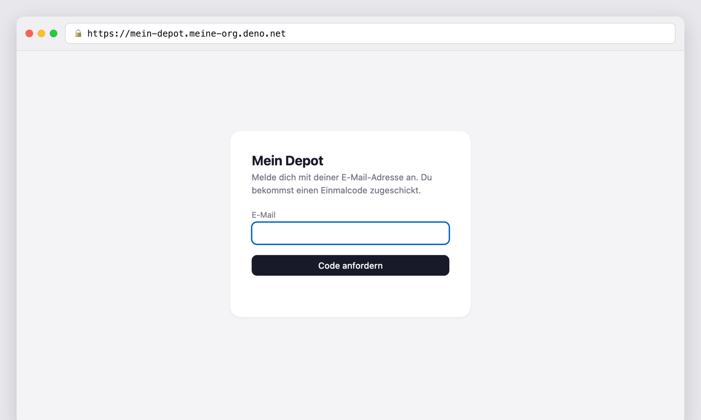

# Stufe 13 — Anmeldung per Einmalcode

Übergeordneter Kontext: [Projekt.md](Projekt.md).

## Der Anlass

Seit Stufe 12 ist die Anwendung öffentlich erreichbar — und war dabei für jeden offen. Der Server
schrieb den API-Schlüssel bei **jedem** Seitenaufruf in das ausgelieferte HTML; so hatte der
Browser ihn seit Stufe 7 bekommen. Lokal war das harmlos, unter einer öffentlichen Adresse hieß
es: Ein Blick in den Seitenquelltext genügte, und man hatte vollen Lese- und Schreibzugriff auf
das Depot.

Diese Stufe schließt das. Der eigentliche Ertrag ist aber nicht die geschlossene Tür, sondern
das, was mit einer Tür überhaupt erst möglich wird.

## Was jetzt möglich ist

### Die Adresse lässt sich weitergeben

Bis hierher war die Adresse ein Geheimnis, das keines sein konnte: Sie stand in der Browserleiste,
und wer sie kannte, war drin. Jetzt darf man sie herumzeigen. Wer nicht eingeladen ist, sieht eine
Anmeldemaske und sonst nichts.

Das klingt klein und ändert alles: Vorher war jede Demonstration ein „komm mal an meinen
Rechner"; die öffentliche Adresse aus Stufe 12 war ein Versprechen, das man nicht einlösen
konnte, ohne das Depot preiszugeben.

### Zu mehreren auf dasselbe Depot schauen

Der praktische Gewinn. Wer sein Portfolio mit jemandem bespricht — Partnerin, Steuerberater,
jemand, der mitentscheidet —, musste bisher den Bildschirm teilen oder exportieren. Jetzt trägt
man eine E-Mail-Adresse ein, und die Person sieht dasselbe Depot, von ihrem Gerät, jederzeit.

Das ist der Unterschied zwischen „ich zeige dir mal was" und „schau selbst rein".

### Anmelden ohne Passwort

Es gibt keins. Man tippt seine E-Mail-Adresse ein, bekommt einen sechsstelligen Code zugeschickt
und ist drin.

Das ist nicht nur bequemer, es nimmt eine ganze Reihe von Dingen aus der Welt, die es sonst gäbe:
kein Passwort ausdenken, keines merken, keines vergessen, kein „Passwort zurücksetzen"-Ablauf,
kein Passwort, das anderswo wiederverwendet wurde und dort gestohlen wird. Was bleibt, ist die
Frage, die ohnehin zählt: *Kommst du an dein Postfach?*

Danach hält eine Sitzung sieben Tage. Man meldet sich also nicht ständig neu an, sondern etwa
einmal die Woche — und auf dem Telefon genauso wie am Rechner.

### Zugang zurücknehmen, sofort

Wer jemanden einträgt, kann ihn auch wieder entfernen — mit einem Klick auf den Papierkorb. Das
wirkt **augenblicklich** und auf allen Geräten: Auch wer gerade angemeldet ist und die Seite offen
hat, ist beim nächsten Klick draußen.

Das war eine bewusste Entscheidung mit Preis (siehe unten), aber sie entspricht dem, was man
erwartet. „Ich habe ihm den Zugang entzogen" soll nicht heißen „in ein paar Tagen dann".

### Sich abmelden

Ein Knopf in der Kopfzeile. Daneben steht, wer gerade angemeldet ist — hilfreich, wenn man
mehrere Adressen hat oder sich fragt, in welcher Rolle man gerade schaut.

Wichtig zu wissen: Abmelden vergisst die Sitzung auf *diesem* Gerät. Ein verlorenes Telefon holt
man damit nicht zurück — dafür entzieht man den Zugang in der Verwaltung.

### Und weiterhin: Skripte

Seit Stufe 7 gilt im Projekt, dass die Oberfläche nur einer von mehreren Clients ist und `curl`
ein gleichberechtigter anderer. Ein Einmalcode per E-Mail hätte das gebrochen — ein Skript kann
keinen Code aus einem Postfach holen. Deshalb gibt es weiterhin den API-Schlüssel:

| Weg | Für wen |
|---|---|
| Einmalcode → Sitzung | Menschen im Browser |
| API-Schlüssel im Kopf der Anfrage | Skripte, `curl`, Automatisierung |

Beide führen zum selben Depot — es gibt ja nur eines.

## Was noch nicht geht

Ehrlichkeit gehört dazu, und die Grenzen sind nach dieser Stufe klarer als vorher:

- **Alle sehen dasselbe.** Es gibt kein zweites Depot für eine zweite Person. Wer eingeladen ist,
  schaut in *dein* Depot.
- **Wer hereindarf, darf alles.** Es gibt keine Leserechte ohne Schreibrechte — jeder Eingeladene
  kann Positionen anlegen und löschen.
- **Niemand kann sich selbst anmelden.** Ohne Einladung kein Zugang, auch nicht auf Anfrage.

Der erste Punkt ist Stufe 16 (Multi-Tenant). Die anderen beiden sind für ein Werkzeug mit einer
Handvoll bekannter Leute vertretbar — man lädt niemanden ein, dem man nicht traut.

## Warum kein offener Sign-up

Der Stufenplan sagt „Auth mit OTP + Multi-User", und die naheliegende Lesart wäre: Jeder kann sich
registrieren. Beim Durchdenken zeigte sich, dass das hier keinen Sinn ergibt — es gibt genau ein
Depot. Fremde könnten sich anmelden und in ein fremdes Portfolio schauen.

Dahinter steckt eine Unterscheidung, die oft verwischt wird:

| | Frage | Stufe |
|---|---|---|
| Authentifizierung | Wer darf herein? | 13 (diese) |
| Mandantenfähigkeit | Wessen Daten sieht er? | 16 |

Offene Registrierung beantwortet die erste Frage, ohne die zweite gelöst zu haben. Eine Einladung
durch den Verwalter beantwortet genau die Frage, die jetzt beantwortbar ist — und liefert
nebenbei das, was praktisch gebraucht wird: gemeinsames Schauen auf ein Portfolio.

Das Datenmodell des Depots bleibt dabei unangetastet: keine Nutzer-ID an einem Kauf. Der Beleg
steht im Code — der Baustein, der das Depot verwaltet, kennt weiterhin keinen Nutzerbegriff.

## Wie es sich anfühlt

Adresse eingeben, „Code anfordern". Der Code kommt binnen Sekunden, steht schon im Betreff — man
muss die Mail also gar nicht öffnen. Eintippen, drin. Beim nächsten Besuch ist man noch angemeldet.

Zwei Details, die aus dem Ausprobieren entstanden sind:

Das **Codefeld ist maskiert**, obwohl ein Mail-Code eigentlich kein Geheimnis ist, das man
verstecken müsste. Der Grund ist der zweite Code — der aus der Konfiguration, der immer gilt. Der
ist ein Generalschlüssel, und den tippt man nicht offen sichtbar ein, wenn jemand danebensteht.

Das Feld nimmt **Buchstaben** an und ist kein Zahlenfeld. Das sieht nach einem Versehen aus, ist
aber nötig: Wenn der Mailversand streikt, ist genau dieser zweite Code der Weg hinein — und er
besteht nicht aus Ziffern.

## Was es technisch gekostet hat

Kurz gefasst, drei Dinge:

**Ein zweiter Body.** Bisher gab es einen: „was steht im Depot". Jetzt kommt „wer darf herein"
daneben. Zwei statt einem, weil sie sich aus verschiedenen Gründen ändern — und weil die Trennung
sichtbar macht, dass das Depot nichts von Nutzern weiß.

**Zugang, der zurückgenommen werden kann.** Die Sitzung ist ein signiertes Token — bequem, weil es
sich ohne Datenbankabfrage prüfen lässt, aber normalerweise unwiderruflich bis zum Ablauf. Sieben
Tage lang jemanden nicht loszuwerden wäre eine schlechte Zusage. Deshalb prüft der Server bei
*jeder* Anfrage zusätzlich, ob die Adresse noch auf der Liste steht. Das kostet eine kleine
Abfrage und kauft die sofortige Wirkung zurück.

**Der Code muss einen Neustart überleben.** Auf der Deploy-Plattform kann die Anwendung mehrfach
laufen: Wer einen Code anfordert, spricht womöglich mit einer anderen Instanz als der, bei der er
ihn einlöst. Läge der Code im Arbeitsspeicher, wäre er dann weg — und der Fehler sähe aus wie ein
falsch eingetippter Code. Er liegt deshalb in der Datenbank, zusammen mit der Zugangsliste.

Dazu die üblichen Vorkehrungen, die man von einem Einmalcode erwartet: zehn Minuten gültig, nur
einmal verwendbar, nach fünf Fehlversuchen verbraucht, nirgends im Klartext gespeichert.

## Ergebnis

Ende-zu-Ende gegen die deployte Anwendung geprüft:

| Prüfung | Ergebnis |
|---|---|
| Schlüssel im ausgelieferten HTML | **weg** |
| Depot ohne Anmeldung | 401 |
| alter, offengelegter Schlüssel | **401** — er wurde ausgetauscht |
| Anmelden per Code, dann Depot | 12 Positionen |
| Eingeladenen entfernen, sein Gerät | **sofort draußen** |
| Code anfordern → Deploy → einlösen | funktioniert |
| Anmeldecodes in den Server-Protokollen | keine |

332 Tests laufen durch, vorher 228.

Ein Fehler fiel dabei erst beim Ausprobieren auf: Der Knopf zur Nutzerverwaltung war auch für
gewöhnliche Nutzer sichtbar, obwohl er als versteckt markiert war — eine eigene CSS-Regel
überstimmte das. Folgenlos, weil der Server jede Anfrage ohnehin prüft und ein Klick ins Leere
lief. Aber ein guter Beleg dafür, dass eine Oberfläche nie die Sicherheitsgrenze ist: Sie zeigt
oder verbirgt, entschieden wird woanders.

## Mitgenommene Lektionen

- Eine Entscheidung, die richtig war, wird nicht dadurch falsch, dass jemand sie ändert — sondern
  dadurch, dass sich ihr Umfeld ändert. Die Schlüssel-Injektion war in Stufe 7 korrekt und stand
  fünf Stufen später unverändert als Leck da.
- Ein grüner Test beweist, dass etwas so ist wie gedacht. Ob das Gedachte noch stimmt, prüft er
  nicht — er schreibt es fest. Hier hat ein Test die Lücke sogar abgesichert.
- Authentifizierung und Mandantenfähigkeit sind zwei Fragen. Wer sie zusammenwirft, baut offene
  Registrierung in eine Anwendung, die nur einen Datenbestand hat.
- Was man nicht zurücknehmen kann, sollte man nicht zusichern. „Zugang entzogen" muss sofort
  gelten, sonst bedeutet es nichts — dafür lohnt sich eine zusätzliche Abfrage bei jeder Anfrage.
- Ein Zugang ohne Passwort nimmt mehr weg als Tipparbeit: kein Zurücksetzen, kein Wiederverwenden,
  kein Vergessen. Die Frage wird auf die reduziert, die ohnehin zählt — kommst du an dein Postfach?
- Die Oberfläche ist nie die Grenze. Ein versteckter Knopf ist Bequemlichkeit, keine Sicherheit;
  wer ihn per Werkzeug umgeht, muss trotzdem abgewiesen werden.
- Jede Hintertür braucht dieselben Grenzen wie der Vordereingang. Der Code, der immer gilt,
  unterliegt derselben Versuchsgrenze und öffnet die Zugangsliste nicht.
